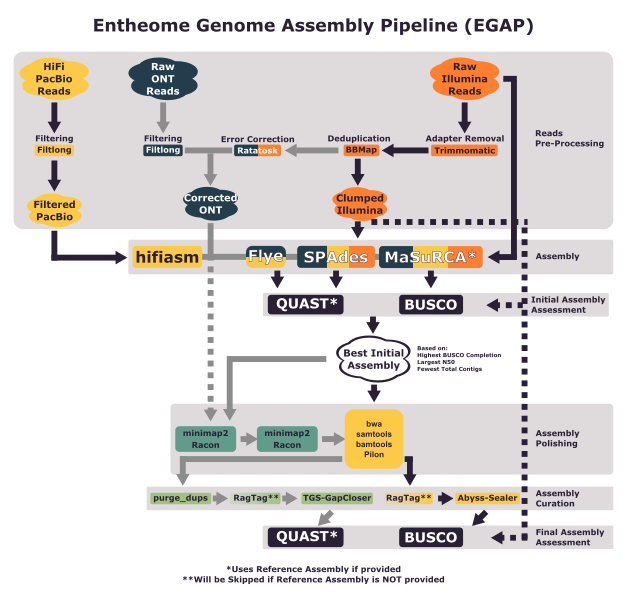

# EGAP Pipeline

<div align="center">
  
</div>

<div align="center">
  <!-- Badges -->
  <a href="https://anaconda.org/bioconda/egap">
    
  </a>
  <a href="https://anaconda.org/bioconda/egap">
    
  </a>
  <a href="https://anaconda.org/bioconda/egap">
    
  </a>
  <a href="https://anaconda.org/bioconda/egap">
    
  </a>
</div>

## Overview

EGAP (Entheome Genome Assembly Pipeline) is a versatile bioinformatics pipeline
for hybrid genome assembly from Oxford Nanopore, Illumina, and PacBio data.
It supports multiple input modes and assembly methods and determines the best 
based on multiple metrics: BUSCO Completeness (Single + Duplicated), Assembly 
Contig Count, Assembly N50, Assembly L50, and Assembly GC-content.

1. **Preprocess & QC Reads**  
   - Merge or detect multiple FASTQ files.
   - Perform read trimming and adapter removal (Trimmomatic, BBDuk).  
   - Deduplicate reads (Clumpify).  
   - Filter and correct ONT reads (Filtlong, Ratatosk).  
   - Generate read metrics (FastQC, NanoPlot, BBMap-based insert-size checks).  

2. **Assembly**  
   - MaSuRCA - Will be performed with Illumina Only or with Hybrid (ONT or PacBio).
   - Flye - Will be performed with ONT only or PacBio only.
   - SPAdes - Will be performed with Illumina only or with Hybrid (ONT or PacBio).
   - hifiasm - Will be performed with PacBio only.
   
3. **Assembly Polishing**
   - Polishes assemblies with Racon (in ONT) and Pilon (if Illumina).  
   - Removes haplotigs with purge_dups.

4. **Assembly Curation**
   - Scaffolds and patches using RagTag against a reference genome (if provided).  
   - Performs final gap-closing with either TGS-GapCloser (if ONT) or ABySS-Sealer (if Illumina-only).  

5. **Quality Assessments & Classification**  
   - Runs Compleasm (BUSCO) on two lineages to measure completeness.  
   - Runs QUAST for contiguity statistics (N50, L50, GC%, etc.).  
   - Rates the final assembly as **AMAZING**, **GREAT**, **OK**, or **POOR** based on combined metrics.  
   - (Optional) Integrates coverage calculations against a reference or final assembly size.  

Though optimized for fungal genomes, EGAP can be adapted to many other organisms by switching up lineages, reference sequences, or default thresholds.

**Note on Supported Input Modes:**  
Currently, the pipeline supports only the following combinations:
- **Illumina input only** (SRA, DIR, or RAW FASTQ files)
- **Illumina input + Reference sequence** (either GCA accession or a path to a FASTA file)
- **Illumina input + ONT input** (SRA, DIR, or RAW FASTQ files)
- **Illumina input + ONT input + Reference sequence**
- **PacBio input only**  (SRA, DIR, or RAW FASTQ files)
- **PacBio input only + Reference sequence**  
- **Illumina input + PacBio input**
- **Illumina input + PacBio input + Reference sequence**

NOTE: it is typically not recommended to use a Reference Sequence when assembling Fungal genomes as it can mask rearrangements.

*Future developments include support for:*
- ONT input only
- ONT input + Reference sequence

## Table of Contents

1. [Overview](#overview)
2. [Installation](#installation)
3. [Pipeline Flow](#pipeline-flow)
4. [Command-Line Usage](#command-line-usage)
5. [CSV Generation](#csv-generation)
6. [Example Data & Instructions](#example-data--instructions)
7. [Quality Control Output Review](#quality-control-output-review)
8. [Future Improvements](#future-improvements)
9. [References](#references)
10. [Contribution](#contribution)
11. [License](#license)

## Installation

A shell script (e.g., `EGAP_setup.sh`) can install most dependencies (Python 3.8+, Conda, and the main bioinformatics tools):

1. **Run**:

```bash
bash /path/to/EGAP_setup.sh
```

The following tools are installed:
- [Trimmomatic](https://github.com/usadellab/Trimmomatic)
- [BBMap](https://sourceforge.net/projects/bbmap/)
- [FastQC](https://www.bioinformatics.babraham.ac.uk/projects/fastqc/)
- [NanoPlot](https://github.com/wdecoster/NanoPlot)
- [Filtlong](https://github.com/rrwick/Filtlong)
- [Ratatosk](https://github.com/DecodeGenetics/Ratatosk)
- [gfatools](https://github.com/lh3/gfatools)
- [hifiasm](https://github.com/chhylp123/hifiasm)
- [MaSuRCA](https://github.com/alekseyzimin/masurca)
- [Flye](https://github.com/mikolmogorov/Flye)
- [SPAdes](https://github.com/ablab/spades)
- [Racon](https://github.com/lbcb-sci/racon)
- [Burrows-Wheeler Aligner](https://github.com/lh3/bwa)
- [SamTools](https://github.com/samtools/samtools)
- [BamTools](https://github.com/hartwigmedical/hmftools/tree/master/bam-tools)
- [Pilon](https://github.com/broadinstitute/pilon)
- [purge_dups](https://github.com/dfguan/purge_dups)
- [RagTag](https://github.com/malonge/RagTag)
- [TGS-GapCloser](https://github.com/BGI-Qingdao/TGS-GapCloser)
- [ABYSS-Sealer](https://github.com/bcgsc/abyss/blob/master/Sealer/sealer.cc)
- [QUAST](https://github.com/ablab/quast)
- [CompleAsm](https://github.com/bioinformatics-centre/compleasm)

Alternatively, you can install the Entheome Ecosystem via Docker. Open a (Linux) terminal in the directory where the `Dockerfile` is located.

```bash
docker build -t entheome_ecosystem .
```

Run the container (adjust the path accordingly):

```bash
docker run -it -v /path/to/data:/path/to/data entheome_ecosystem bash
```

Inside the Docker container, load the pre-generated EGAP environment:

```bash
source /EGAP_env/bin/activate
```

*Future developments include support for:*
- Anaconda installation in a dedicated environment through the Bioconda channel with the following command:

```bash
conda create -y EGAP_env python=3.8 && conda activate EGAP_env && conda install -y -c bioconda egap
```

## Pipeline Flow

<div align="center">
  
</div>

## Command-Line Usage

### Parameters:

- `--input_csv`, `-csv` (str): Path to a CSV containing multiple sample data. (default = None)
- `--ont_sra`, `-osra` (str): Oxford Nanopore Sequence Read Archive (SRA) Accession number. (if `-csv` = None; else None)
- `--raw_ont_dir`, `-odir` (str): Path to a directory containing all Raw ONT Reads. (if `-csv` = None; else REQUIRED)
- `--raw_ont_reads`, `-i0` (str): Path to the combined Raw ONT FASTQ reads. (if `-csv` = None; else REQUIRED)
- `--illu_sra`, `-isra` (str): Illumina Sequence Read Archive (SRA) Accession number. (if `-csv` = None; else None)
- `--raw_illu_dir`, `-idir` (str): Path to a directory containing all Raw Illumina Reads. (if `-csv` = None; else None)
- `--raw_illu_reads_1`, `-i1` (str): Path to the Raw Forward Illumina Reads. (if `-csv` = None; else REQUIRED)
- `--raw_illu_reads_2`, `-i2` (str): Path to the Raw Reverse Illumina Reads. (if `-csv` = None; else REQUIRED)
- `--pacbio_sra`, `-psra` (str): PacBio Sequence Read Archive (SRA) Accession number. (if `-csv` = None; else None)
- `--raw_pacbio_dir`, `-pdir` (str): Path to a directory containing all Raw PacBio Reads. (if `-csv` = None; else None)
- `--raw_pacbio_reads`, `-preads` (str): Path to the combined Raw PacBio FASTQ reads. (if `-csv` = None; else REQUIRED)
- `--species_id`, `-ID` (str): Species ID formatted as `<2-letters of Genus>_<full species name>`. (if `-csv` = None; else REQUIRED)
- `--organism_kingdom`, `-Kg` (str): Kingdom the current organism data belongs to. (default: Funga)
- `--organism_karyote`, `-Ka` (str): Karyote type of the organism. (default: Eukaryote)
- `--compleasm_1`, `-c1` (str): Name of the first organism compleasm/BUSCO database to compare to. (default: basidiomycota)
- `--compleasm_2`, `-c2` (str): Name of the second organism compleasm/BUSCO database to compare to. (default: agaricales)
- `--est_size`, `-es` (str): Estimated size of the genome in Mbp (e.g., `60m`). (default: 60m)
- `--ref_seq_gca`, `-rgca` (str): Curated Genome Assembly (GCA) Accession number. (default = None)
- `--ref_seq`, `-rf` (str): Path to the reference genome for assembly. (default: None)
- `--percent_resources`, `-R` (float): Percentage of resources for processing. (default: 1.00)
- `--cpu_threads`, `-T` (float): Exact number of CPU threads to use. (default: None)
- `--ram_gb`, `-ram`, (float): Exact amount of RAM (in GB) to use. (default: None)
                        
### Example Command:

```bash
EGAP --raw_ont_reads /path/to/ont_reads.fq.gz \ # A combined reads file of all ONT raw reads
     --raw_illu_dir /path/to/illumina_reads/ \ # A folder containing an md5 checksum file and individual Illumina reads files
     --species_id AB_speciesname \
     --organism_kingdom Funga \
     --organism_karyote Eukaryote \
     --compleasm_1 basidiomycota \
     --compleasm_2 agaricales \
     --est_size 60m \
     --percent_resources 0.8
```

Or, providing SRA numbers (which will download the files into the current working directory):

```bash
EGAP --ont_sra SRR######## \
     --illu_sra SRR######## \
     --species_id AB_speciesname \
     --organism_kingdom Funga \
     --organism_karyote Eukaryote \
     --compleasm_1 basidiomycota \
     --compleasm_2 agaricales \
     --est_size 60m \
     --cpu_threads 10 \ # Providing a specific number for CPUs and NOT using percent resources requires the next line
     --ram_gb 32 # Required if NOT using percent resources
```

*Note:* Do not use multiple inputs for the same data type (e.g., do NOT use `illu_sra` and `raw_illu_dir` simultaneously).

Alternatively, using a CSV file for multiple samples:

```bash
EGAP --input_csv /path/to/samples.csv
```

## CSV Generation

To run EGAP with multiple samples, provide a CSV file containing the necessary information for each sample.

### CSV Format

The CSV file should have the following header and columns:

| ONT_SRA       | ONT_RAW_DIR  | ONT_RAW_READS               | ILLUMINA_SRA  | ILLUMINA_RAW_DIR   | ILLUMINA_RAW_F_READS                | ILLUMINA_RAW_R_READS                | PACBIO_SRA | PACBIO_RAW_DIR | PACBIO_RAW_READS          | SPECIES_ID           | ORGANISM_KINGDOM  | ORGANISM_KARYOTE  | COMPLEASM_1    | COMPLEASM_2  | EST_SIZE  | REF_SEQ_GCA   | REF_SEQ                    |
|---------------|--------------|-----------------------------|---------------|--------------------|-------------------------------------|-------------------------------------|------------|----------------|---------------------------|----------------------|-------------------|-------------------|----------------|--------------|-----------|---------------|----------|
| None          | None         | None                        | SRA00000001   | None               | None                                | None                                | None       | None           | None                      | Ab_sample1           | Funga             | Eukaryote         | basidiomycota  | agaricales   | 55m       | GCA00000001.1 | None     |
| None          | None         | /path/to/ONT/sample1.fq.gz  | None          | None               | /path/to/Illumina/sample1_1.fq.gz   | /path/to/Illumina/sample1_2.fq.gz   | None       | None           | None                      | Ab_sample2           | Funga             | Eukaryote         | basidiomycota  | agaricales   | 60m       | None          | None     |
| None          | None         | None                        | None          | None               | None                                | None                                | None       | None           | /path/to/pacbio.fastq.gz  | Ab_sample3           | Funga             | Eukaryote         | basidiomycota  | agaricales   | 55m       | None          | None     |
| None          | None         | None                        | SRA00000002   | None               | None                                | None                                | None       | None           | /path/to/pacbio.fastq.gz  | Ab_sample4_sub-name  | Funga             | Eukaryote         | basidiomycota  | agaricales   | 55m       | GCA00000002.1 | None     |

### Column Descriptions

- **ONT_SRA**: Oxford Nanopore Sequence Read Archive (SRA) Accession number. Use `None` if specifying individual files.
- **ONT_RAW_DIR**: Path to the directory containing all Raw ONT Reads. Use `None` if specifying individual files.
- **ONT_RAW_READS**: Path to the combined Raw ONT FASTQ reads (e.g., `/path/to/ONT/sample1.fq.gz`).
- **ILLUMINA_SRA**: Illumina Sequence Read Archive (SRA) Accession number. Use `None` if specifying individual files.
- **ILLUMINA_RAW_DIR**: Path to the directory containing all Raw Illumina Reads. Use `None` if specifying individual files.
- **ILLUMINA_RAW_F_READS**: Path to the Raw Forward Illumina Reads (e.g., `/path/to/Illumina/sample1_R1.fq.gz`).
- **ILLUMINA_RAW_R_READS**: Path to the Raw Reverse Illumina Reads (e.g., `/path/to/Illumina/sample1_R2.fq.gz`).
- **PACBIO_SRA**: PacBio Sequence Read Archive (SRA) Accession number. Use `None` if specifying individual files.
- **PACBIO_RAW_DIR**: Path to the directory containing all Raw PacBio Reads. Use `None` if specifying individual files.
- **PACBIO_RAW_READS**: Path to the combined Raw PacBio FASTQ reads (e.g., `/path/to/PACBIO/sample1.fq.gz`).
- **SPECIES_ID**: Species ID formatted as `<2-letters of Genus>_<full species name>` (e.g., `Ab_sample1`, optionally `Ab_sample4_sub-name`).
- **ORGANISM_KINGDOM**: Kingdom of the organism (default: `Funga`).
- **ORGANISM_KARYOTE**: Karyote type of the organism (default: `Eukaryote`).
- **COMPLEASM_1**: Name of the first compleasm/BUSCO database (default: basidiomycota).
- **COMPLEASM_2**: Name of the second compleasm/BUSCO database (default: agaricales).
- **EST_SIZE**: Estimated genome size in Mbp (e.g., `60m`).
- **REF_SEQ_GCA**: Curated Genome Assembly (GCA) Accession number (or `None`).
- **REF_SEQ**: Path to the reference genome for assembly (or `None`).

### Example CSV File (`EGAP_test.csv` included in repository)

```csv
ONT_SRA,ONT_RAW_DIR,ONT_RAW_READS,ILLUMINA_SRA,ILLUMINA_RAW_DIR,ILLUMINA_RAW_F_READS,ILLUMINA_RAW_R_READS,PACBIO_SRA,PACBIO_RAW_DIR,PACBIO_RAW_READS,SPECIES_ID,ORGANISM_KINGDOM,ORGANISM_KARYOTE,COMPLEASM_1,COMPLEASM_2,EST_SIZE,REF_SEQ_GCA,REF_SEQ
None,None,None,SRR13870683,None,None,None,None,None,None,Ps_cubensis_B+,Funga,eukaryote,basidiomycota,agaricales,60m,GCF_017499595.1,None
SRR25920759,None,None,SRR25920760,None,None,None,None,None,None,Ps_semilanceata,Funga,eukaryote,basidiomycota,agaricales,60m,None,None
None,None,None,None,None,None,None,SRP093873,None,None,Pa_papilionaceus,Funga,eukaryote,basidiomycota,agaricales,60m,None,None
```

### Notes

- If you provide a value for `ILLUMINA_RAW_DIR`, set `ILLUMINA_RAW_F_READS` and `ILLUMINA_RAW_R_READS` to `None`. EGAP will automatically detect and process all paired-end reads within that directory. The same applies for `ONT_RAW_DIR`.
- Ensure that all file paths are correct and accessible.
- The CSV file should not contain extra spaces or special characters in the headers.

## Example Data & Instructions

### Create the Folder Structure

First, create the main processing folder with the required sub-folders. Adjust "EGAP_Processing" as needed:

```bash
mkdir -p /path/to/EGAP/EGAP_Processing/
```

If you are providing your own data locally, be sure to have a species folder and *if needed a sub-folder matching your Species ID:
Example: Illumina Only data for Psilocybe cubensis B+ with reference sequence of Psilocybe cubensis
- /path/to/EGAP/EGAP_Processing/Ps_cubensis/Ps_cubensis_B+/Illumina/f_reads.fastq.gz
- /path/to/EGAP/EGAP_Processing/Ps_cubensis/Ps_cubensis_B+/Illumina/r_reads.fastq.gz)
- /path/to/EGAP/EGAP_Processing/Ps_cubensis/ref_seq.fasta

If no sub-folder for sub-species is needed then place everything in the main species folder i.e.:
- /path/to/EGAP/EGAP_Processing/Ps_semilanceata/Illumina/f_reads.fastq.gz

##### Illumina-Only (with Reference Sequence) Assembly Command

```bash
EGAP --illu_sra SRR13870683 \
     --species_id Ps_cubensis_B+ \
     --organism_kingdom Funga \
     --organism_karyote eukaryote \
     --compleasm_1 agaricales \
     --compleasm_2 basidiomycota \
     --est_size 700m \
     --ref_seq_gca GCF_017499595.1
```

##### ONT/Illumina Hybrid Assembly Command

```bash
EGAP --ont_sra SRR25920759 \
     --illu_sra SRR25920760 \
     --species_id Ps_semilanceata \
     --organism_kingdom Funga \
     --organism_karyote eukaryote \
     --compleasm_1 agaricales \
     --compleasm_2 basidiomycota \
     --est_size 60m
```

##### PacBio-Only (no Reference Sequence) Assembly Command

```bash
EGAP --pacbio_sra SRP093873 \
     --species_id Pa_papilionaceus \
     --organism_kingdom Funga \
     --organism_karyote eukaryote \
     --compleasm_1 agaricales \
     --compleasm_2 basidiomycota \
     --est_size 60m
```

## Quality Control Output Review

EGAP generates final assemblies along with:
- **QUAST** metrics (contig count, N50, L50, GC%, coverage)
- **Compleasm (BUSCO)** plots showing Single, Duplicated, Fragmented & Missing scores.
- Final assembly classification: **AMAZING, GREAT, OK,** or **POOR**

### Statistics Thresholds

The current thresholds for each metric classification (subject to change) are:
- **first_compleasm_c** = {"AMAZING": >98.5, "GREAT": >95.0, "OK": >80.0, "POOR": <80.0}
- **second_compleasm_c** = {"AMAZING": >98.5, "GREAT": >95.0, "OK": >80.0, "POOR": <80.0}
- **contigs_thresholds** = {"AMAZING": 100, "GREAT": 1000, "OK": 10000, "POOR": 100000}
- **n50_thresholds** = {"AMAZING": 1000000, "GREAT": 100000, "OK": 1000, "POOR": 100}
- **l50_thresholds** = {"AMAZING": #, "GREAT": #, "OK": #, "POOR": #} (still determining best metrics)

### Compleasm BUSCO Plots

BUSCO outputs are evaluated based on:
- Greater than 98.5% Completion (sum of Single and Duplicated genes) for an AMAZING/Great Assembly
- Greater than 95.0% Completion for a Good Assembly
- Greater than 80% Completion for an OK Assembly
- Less than 80% Completion for a POOR Assembly

Additionally, fewer contigs aligning to BUSCO genes is preferable. Contigs with only duplicated genes are excluded from the plot (noted in the x-axis label).

#### Illumina-Only (with Reference Sequence) Assembly BUSCO Plots

<table align="center">
  <tr>
    <td align="center">
      
      <br>
      **My. speciosa eudicots BUSCO**
    </td>
    <td align="center">
      
      <br>
      **My. speciosa embryophyta BUSCO**
    </td>
  </tr>
</table>

*Flora are known to have large amounts of duplicated genes.*

#### ONT/Illumina Hybrid Assembly BUSCO Plots

<table align="center">
  <tr>
    <td align="center">
      
      <br>
      **Ps. semilanceata agaricales BUSCO**
    </td>
    <td align="center">
      
      <br>
      **Ps. semilanceata basidiomycota BUSCO**
    </td>
  </tr>
</table>

*Funga are known to have multinucleate cells and may exhibit higher levels of duplicated genes, though not as extensively as Flora.*

#### PacBio-Only (no Reference Sequence) Assembly BUSCO Plots

<table align="center">
  <tr>
    <td align="center">
      
      <br>
      **Pa. papilionaceus agaricales BUSCO**
    </td>
    <td align="center">
      
      <br>
      **Pa. papilionaceus basidiomycota BUSCO**
    </td>
  </tr>
</table>

*Funga are known to have multinucleate cells and may exhibit higher levels of duplicated genes, though not as extensively as Flora.*

## Future Improvements

- **Automated Quality Assessment Reports**: Generate comprehensive quality reports post-assembly for easier analysis.
- **Improved Data Management**: Automated removal of excess files upon pipeline completion.
- **Enhanced Support for Diverse Genomes**: Optimize pipeline parameters for non-fungal genomes to improve versatility.
- **Improved Error Handling**: Develop robust error detection and user-friendly feedback.
- **Integration with Additional Sequencing Platforms**:  
  - Support for ONT input only and ONT input with Reference sequence.  
  
## References

This pipeline was modified from two of the following pipelines:

> Bollinger IM, Singer H, Jacobs J, Tyler M, Scott K, Pauli CS, Miller DR, Barlow C, Rockefeller A, Slot JC, Angel-Mosti V.
> High-quality draft genomes of ecologically and geographically diverse *Psilocybe* species.
> *Microbiol Resour Announc* 0:e00250-24; doi: [10.1128/mra.00250-24](https://doi.org/10.1128/mra.00250-24)

> Muñoz-Barrera A, Rubio-Rodríguez LA, Jáspez D, Corrales A, Marcelino-Rodriguez I, Lorenzo-Salazar JM, González-Montelongo R, Flores C.
> Benchmarking of bioinformatics tools for the hybrid de novo assembly of human whole-genome sequencing data.  
> *bioRxiv* 2024.05.28.595812; doi: [10.1101/2024.05.28.595812](https://doi.org/10.1101/2024.05.28.595812)

The example data are published in:

> Bollinger IM, Singer H, Jacobs J, Tyler M, Scott K, Pauli CS, Miller DR, Barlow C, Rockefeller A, Slot JC, Angel-Mosti V.
> High-quality draft genomes of ecologically and geographically diverse *Psilocybe* species.
> *Microbiol Resour Announc* 0:e00250-24; doi: [10.1128/mra.00250-24](https://doi.org/10.1128/mra.00250-24)

> McKernan K, Kane L, Helbert Y, Zhang L, Houde N, McLaughlin S.
> A whole genome atlas of 81 Psilocybe genomes as a resource for psilocybin production.
> F1000Research 2021, 10:961; doi: [10.12688/f1000research.55301.2](https://doi.org/10.12688/f1000research.55301.2)

> Ruiz‐Dueñas FJ, Barrasa JM, Sánchez‐García M, Camarero S, Miyauchi S, Serrano A, Linde D, Babiker R, Drula E, Ayuso‐Fernández I, Pacheco R,
> Padilla G, Ferreira P, Barriuso J, Kellner H, Castanera R, Alfaro M, Ramírez L, Pisabarro AG, Riley R, Kuo A, Andreopoulos W, LaButti K,
> Pangilinan J, Tritt A, Lipzen A, He G, Yan M, Ng V, Grigoriev IV, Cullen D, Martin F, Rosso M, Henrissat B, Hibbett D, Martínez AT.
> Genomic Analysis Enlightens Agaricales Lifestyle Evolution and Increasing Peroxidase Diversity. Molecular Biology and Evolution. 38(4): 1428-1446 (2020). [10.1093/molbev/msaa301](https://doi.org/10.1093/molbev/msaa301).

## Contribution

If you would like to contribute to the EGAP Pipeline, please submit a pull request or open an issue on GitHub. For major changes, please discuss via an issue first. 

## License

This project is licensed under the BSD 3-Clause License.
