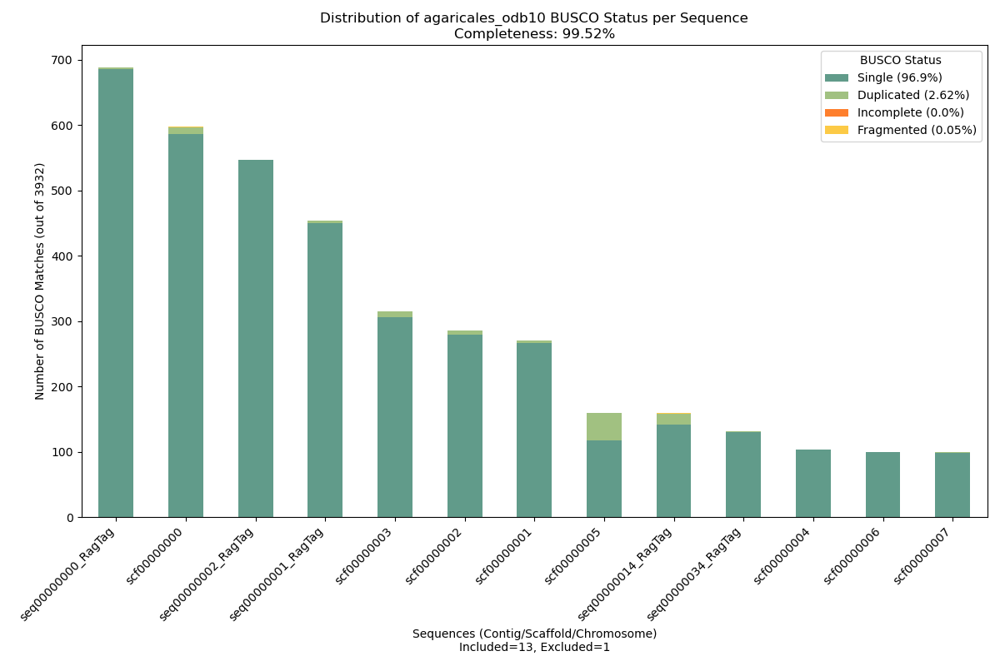
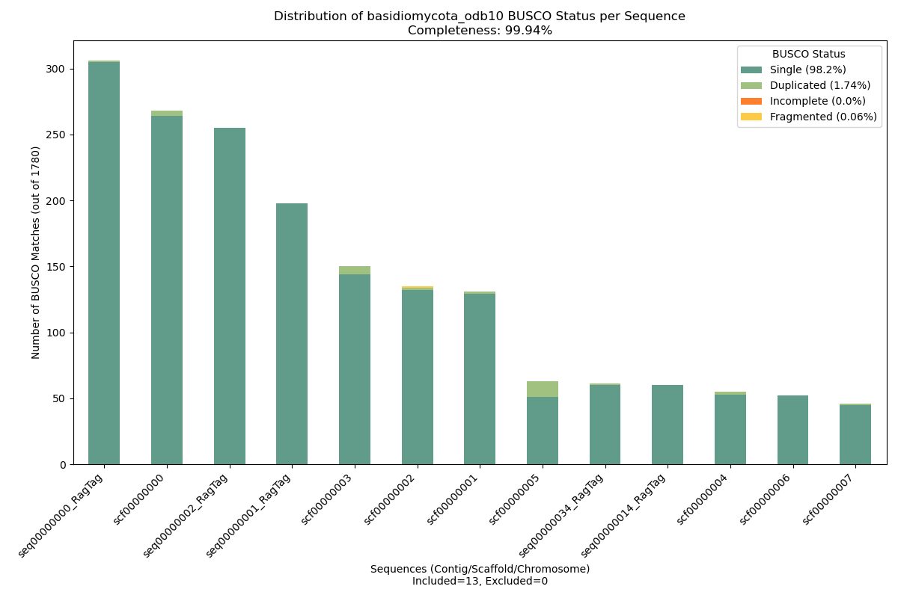
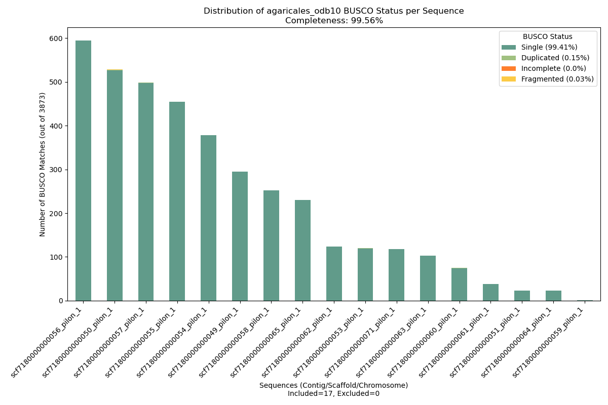
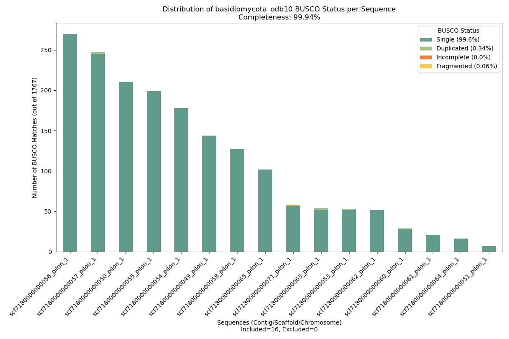
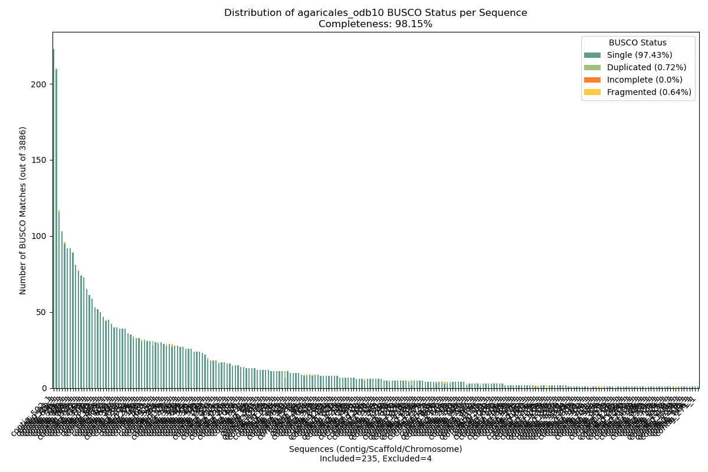
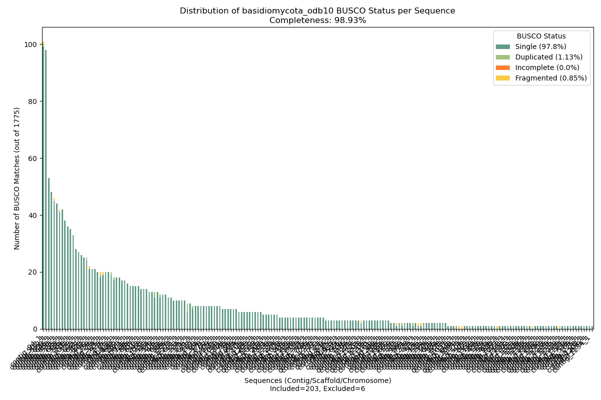

# EGAP Pipeline

<div align="center">
  
</div>

<div align="center">
  <!-- Conda Version -->
  <a href="https://anaconda.org/bioconda/egap">
    
  </a>
  <!-- Latest Release Date (from GitHub) -->
  <a href="https://github.com/iPsychonaut/EGAP/releases/latest">
    
  </a>
  <!-- Platforms (static “noarch”) -->
  <a href="https://anaconda.org/bioconda/egap">
    
  </a>
  <!-- Total Downloads -->
  <a href="https://anaconda.org/bioconda/egap">
    
  </a>
</div>

## Overview

EGAP (Entheome Genome Assembly Pipeline) is a versatile bioinformatics pipeline for hybrid genome assembly using Oxford Nanopore (ONT), Illumina, and PacBio data. It evaluates assemblies based on BUSCO Completeness (Single + Duplicated), Assembly Contig Count, and N50, with additional metrics like L50 and GC-content available via WUAST.

1. **Preprocess & QC Reads**  
   - Merges multiple FASTQ files (`ont_combine_fastq_gz`, `illumina_extract_and_check`).  
   - Trims and removes adapters (Trimmomatic, BBDuk).  
   - Deduplicates reads (Clumpify).  
   - Filters and corrects ONT reads (Filtlong, Ratatosk).  
   - Generates Read Metrics (FastQC, NanoPlot, BBMap insert-size stats).  

2. **Assembly**  
   - MaSuRCA: Illumina-only or hybrid (ONT/PacBio).  
   - Flye: ONT-only or PacBio-only.  
   - SPAdes: Illumina-only or hybrid (ONT/PacBio).  
   - hifiasm: PacBio-only.
   - Best Assembly Selection based on Read Metrics from all available assemblies.
     - Runs BUSCO/Compleasm on two lineages for completeness.  
     - Runs QUAST for contiguity (N50, contig count, etc.). 

3. **Assembly Polishing**  
   - Polishes with Racon (2x, if ONT/PacBio) and Pilon (if Illumina).  
   - Removes haplotigs with purge_dups (if long reads).  

4. **Assembly Curation**  
   - Scaffolds and patches with RagTag (if reference provided).  
   - Closes gaps with TGS-GapCloser (ONT) or Abyss-Sealer (Illumina-only).  

5. **Quality Assessments & Classification**  
   - Runs BUSCO/Compleasm on two lineages for completeness.  
   - Runs QUAST for contiguity (N50, contig count, etc.).  
   - Classifies assemblies as **AMAZING**, **GREAT**, **OK**, or **POOR**.  

Optimized for fungal genomes, EGAP is adaptable to other organisms by adjusting lineages and references.

**Supported Input Modes:**  
- Illumina-only (SRA, DIR, or RAW FASTQ)  
- Illumina + Reference (GCA or FASTA)  
- Illumina + ONT (SRA, DIR, or RAW FASTQ)  
- Illumina + ONT + Reference  
- PacBio-only (SRA, DIR, or RAW FASTQ)  
- Assembly-only (for QC analysis)  

*Future developments:* Support for ONT-only and ONT + Reference.

## Table of Contents

1.  [Overview](#overview)
2.  [Installation](#installation)
3.  [Pipeline Flow](#pipeline-flow)
4.  [Command-Line Usage](#command-line-usage)
5.  [CSV Generation](#csv-generation)
6.  [Example Data & Instructions](#example-data--instructions)
7.  [Quality Control Output Review](#quality-control-output-review)
8.  [Future Improvements](#future-improvements)
9.  [References](#references)
10. [Contribution](#contribution)
11. [License](#license)

## Installation

The following tools are installed:
- [Trimmomatic](https://github.com/usadellab/Trimmomatic)
- [BBMap](https://sourceforge.net/projects/bbmap/)
- [FastQC](https://www.bioinformatics.babraham.ac.uk/projects/fastqc/)
- [NanoPlot](https://github.com/wdecoster/NanoPlot)
- [Filtlong](https://github.com/rrwick/Filtlong)
- [Ratatosk](https://github.com/DecodeGenetics/Ratatosk)
- [gfatools](https://github.com/lh3/gfatools)
- [hifiasm](https://github.com/chhylp123/hifiasm)
- [MaSuRCA](https://github.com/alekseyzimin/masurca)
- [Flye](https://github.com/mikolmogorov/Flye)
- [SPAdes](https://github.com/ablab/spades)
- [Racon](https://github.com/lbcb-sci/racon)
- [Burrows-Wheeler Aligner](https://github.com/lh3/bwa)
- [SamTools](https://github.com/samtools/samtools)
- [BamTools](https://github.com/hartwigmedical/hmftools/tree/master/bam-tools)
- [Pilon](https://github.com/broadinstitute/pilon)
- [purge_dups](https://github.com/dfguan/purge_dups)
- [RagTag](https://github.com/malonge/RagTag)
- [TGS-GapCloser](https://github.com/BGI-Qingdao/TGS-GapCloser)
- [ABYSS-Sealer](https://github.com/bcgsc/abyss/blob/master/Sealer/sealer.cc)
- [QUAST](https://github.com/ablab/quast)
- [BUSCO](https://gitlab.com/ezlab/busco)
- [Compleasm](https://github.com/bioinformatics-centre/compleasm)

##### Install Via Bash:
The available shell script: `EGAP_setup.sh`, can install all dependencies (Python 3.8+, Conda, and the main bioinformatics tools):

```bash
bash /path/to/EGAP/bin/EGAP_setup.sh
```

##### Install Via Docker:
Open a terminal in the directory where the `Dockerfile` is located and run:

```bash
docker build -t entheome_ecosystem .
```

Run the container (adjust the path accordingly):

```bash
docker run -it -v /path/to/data/mnt:/path/to/data/mnt entheome_ecosystem bash
```

Inside the Docker container, load the pre-generated EGAP environment:

```bash
source /EGAP_env/bin/activate
```

##### Install Via Nextflow/Singularity: 
Open a terminal in the directory where the `entheome.sif.def` is located and run:

```bash
sudo singularity build entheome.sif entheome.sif.def 
```

Edit the parameters in the nextflow.config and run (ensure both nextflow.config and entheome.sif are in the same directory as draft_assembly.nf):

```bash
nextflow draft_assembly.nf -with-singularity entheome.sif
```

OR

Load into the Singularity image, load the pre-generated EGAP environment:

```bash
singularity shell entheome.sif -B /path/to/data/mnt:/path/to/data/mnt && \
source /opt/conda/etc/profile.d/conda.sh && \
conda activate EGAP_env
```

##### Install Via Anaconda:
In a dedicated environment through the Bioconda channel with the following command:

```bash
conda create -y -n EGAP_env python=3.8 && conda activate EGAP_env && conda install -y -c bioconda egap
```

## Pipeline Flow

<div align="center">
  
</div>

## Command-Line Usage

### Parameters
- `--input_csv`, `-csv` (str): Path to CSV with sample data (default: None).
- `--output_dir`, `-o` (str): Path to the desired output directory (default: None).
- `--cpu_threads`, `-t` (int): CPU threads (default: 1).
- `--ram_gb`, `-r` (int): RAM in GB (default: 8).
                        
### Example Command:

```bash
EGAP -csv /path/to/input.csv -o /path/to/output_dir -t 1 -r 8
```

## CSV Generation

It is necssary to provide a CSV file containing the necessary information for each sample.

### CSV Format

The CSV file should have the following header and columns:

| ONT_SRA       | ONT_RAW_DIR  | ONT_RAW_READS               | ILLUMINA_SRA  | ILLUMINA_RAW_DIR   | ILLUMINA_RAW_F_READS                | ILLUMINA_RAW_R_READS                | PACBIO_SRA | PACBIO_RAW_DIR | PACBIO_RAW_READS          | SPECIES_ID           | SAMPLE_ID            | ORGANISM_KINGDOM  | ORGANISM_KARYOTE  | BUSCO_1        | BUSCO_2      | EST_SIZE  | REF_SEQ_GCA   | REF_SEQ  |
|---------------|--------------|-----------------------------|---------------|--------------------|-------------------------------------|-------------------------------------|------------|----------------|---------------------------|----------------------|----------------------|-------------------|-------------------|----------------|--------------|-----------|---------------|----------|
| None          | None         | None                        | SRA00000001   | None               | None                                | None                                | None       | None           | None                      | Ab_sample1           | Ab_sample1           | Funga             | Eukaryote         | basidiomycota  | agaricales   | 55m       | GCA00000001.1 | None     |
| None          | None         | /path/to/ONT/sample1.fq.gz  | None          | None               | /path/to/Illumina/sample1_1.fq.gz   | /path/to/Illumina/sample1_2.fq.gz   | None       | None           | None                      | Ab_sample2           | Ab_sample2_ONT       | Funga             | Eukaryote         | basidiomycota  | agaricales   | 60m       | None          | None     |
| None          | None         | None                        | None          | None               | None                                | None                                | None       | None           | /path/to/pacbio.fastq.gz  | Ab_sample3           | Ab_sample3_Illu      | Funga             | Eukaryote         | basidiomycota  | agaricales   | 55m       | None          | None     |
| None          | None         | None                        | SRA00000002   | None               | None                                | None                                | None       | None           | /path/to/pacbio.fastq.gz  | Ab_sample4           | Ab_sample4_sub-name  | Funga             | Eukaryote         | basidiomycota  | agaricales   | 55m       | GCA00000002.1 | None     |

### Column Descriptions

- **ONT_SRA**: Oxford Nanopore Sequence Read Archive (SRA) Accession number. Use `None` if specifying individual files.
- **ONT_RAW_DIR**: Path to the directory containing all Raw ONT Reads. Use `None` if specifying individual files.
- **ONT_RAW_READS**: Path to the combined Raw ONT FASTQ reads (e.g., `/path/to/ONT/sample1.fq.gz`).
- **ILLUMINA_SRA**: Illumina Sequence Read Archive (SRA) Accession number. Use `None` if specifying individual files.
- **ILLUMINA_RAW_DIR**: Path to the directory containing all Raw Illumina Reads. Use `None` if specifying individual files.
- **ILLUMINA_RAW_F_READS**: Path to the Raw Forward Illumina Reads (e.g., `/path/to/Illumina/sample1_R1.fq.gz`).
- **ILLUMINA_RAW_R_READS**: Path to the Raw Reverse Illumina Reads (e.g., `/path/to/Illumina/sample1_R2.fq.gz`).
- **PACBIO_SRA**: PacBio Sequence Read Archive (SRA) Accession number. Use `None` if specifying individual files.
- **PACBIO_RAW_DIR**: Path to the directory containing all Raw PacBio Reads. Use `None` if specifying individual files.
- **PACBIO_RAW_READS**: Path to the combined Raw PacBio FASTQ reads (e.g., `/path/to/PACBIO/sample1.fq.gz`).
- **SPECIES_ID**: Species ID formatted as `<full species name>` (e.g., `Escherichia_coli`).
- **SAMPLE_ID**: Sample ID formatted as `<full species name>-<other identifiers>` (e.g., `Escherichia_coli-Illu-SRR32496875`).
- **ORGANISM_KINGDOM**: Kingdom of the organism (default: `None`).
- **ORGANISM_KARYOTE**: Karyote type of the organism (default: `None`).
- **BUSCO_1**: Name of the first compleasm/BUSCO database (default: `None`).
- **BUSCO_2**: Name of the second compleasm/BUSCO database (default: `None`).
- **EST_SIZE**: Estimated genome size in Mbp (e.g., `None`).
- **REF_SEQ_GCA**: Curated Genome Assembly (GCA) Accession number (or `None`).
- **REF_SEQ**: Path to the reference genome for assembly (or `None`).

### Notes

- If you provide a value for `ILLUMINA_RAW_DIR`, set `ILLUMINA_RAW_F_READS` and `ILLUMINA_RAW_R_READS` to `None`. EGAP will automatically detect and process all paired-end reads within that directory. The same applies for `ONT_RAW_DIR`.
- Ensure that all file paths are correct and accessible.
- The CSV file should not contain extra spaces or special characters in the headers.
- If you just want to perform QC analysis for an already built assembly: provide the path for the assembly or GCA Accession number to download, in the `REF_SEQ` or `REF_SEQ_GCA` field respectively, provide `ORGANISM_KARYOTE`, and the two compleasm databases (`BUSCO_1`, `BUSCO_2`) to use; **DO NOT PROVIDE ESTIMATED SIZE (`EST_SIZE`)**.

### Example CSV File

`EGAP_test.csv` is included in this repository to run test examples, to run all four files takes about 24hours on a 16 thread, 64GB system.

```csv
ONT_SRA,ONT_RAW_DIR,ONT_RAW_READS,ILLUMINA_SRA,ILLUMINA_RAW_DIR,ILLUMINA_RAW_F_READS,ILLUMINA_RAW_R_READS,PACBIO_SRA,PACBIO_RAW_DIR,PACBIO_RAW_READS,SAMPLE_ID,SPECIES_ID,ORGANISM_KINGDOM,ORGANISM_KARYOTE,BUSCO_1,BUSCO_2,EST_SIZE,REF_SEQ_GCA,REF_SEQ
None,None,None,None,None,None,None,None,None,None,Escherichia_coli-RefSeq,Escherichia_coli,Bacteria,prokaryote,gammaproteobacteria,enterobacterales,None,GCA_000005845.2,None
None,None,None,SRR32496875,None,None,None,None,None,None,Escherichia_coli-Illu-RefSeq,Escherichia_coli,Bacteria,prokaryote,gammaproteobacteria,enterobacterales,5m,GCA_000005845.2,None
SRR32405433,None,None,SRR32496875,None,None,None,None,None,None,Escherichia_coli-ONT-Illu,Escherichia_coli,Bacteria,prokaryote,gammaproteobacteria,enterobacterales,5m,None,None
None,None,None,None,None,None,None,SRR31460895,None,None,Escherichia_coli-PacBio,Escherichia_coli,Bacteria,prokaryote,gammaproteobacteria,enterobacterales,5m,None,None
```

### Local Data
If you are providing your own data locally, be sure to have a species folder and *if needed a sub-folder matching your Species ID:
Example: Illumina Only data for Psilocybe cubensis B+ with reference sequence of Psilocybe cubensis
- /path/to/EGAP/EGAP_Processing/Ps_cubensis/Ps_cubensis_B+/Illumina/f_reads.fastq.gz
- /path/to/EGAP/EGAP_Processing/Ps_cubensis/Ps_cubensis_B+/Illumina/r_reads.fastq.gz)
- /path/to/EGAP/EGAP_Processing/Ps_cubensis/ref_seq.fasta

If no sub-folder for sub-species is needed then place everything in the main species folder i.e.:
- /path/to/EGAP/EGAP_Processing/Ps_semilanceata/Illumina/f_reads.fastq.gz

## Quality Control Output Review

EGAP generates final assemblies along with:
- **QUAST** metrics (contig count, N50, L50, GC%, coverage)
- **BUSCO/Compleasm** plots showing Single, Duplicated, Fragmented & Missing scores.
- Final assembly classification: **AMAZING, GREAT, OK,** or **POOR**

### Statistics Thresholds

The current thresholds for each metric classification (subject to change) are:
- **first_busco_c** = {"AMAZING": =>98.5, "GREAT": =>90.0, "OK": =>75.0, "POOR": <75.0}
- **second_busco_c** = {"AMAZING": =>98.5, "GREAT": =>90.0, "OK": =>75.0, "POOR": <75.0}
- **contigs_thresholds** = {"AMAZING": <100, "GREAT": <1000, "OK": <10000, "POOR": >10000}
- **n50_thresholds** = {"AMAZING": >100000, "GREAT": >10000, "OK": >1000, "POOR": <1000}
- **l50_thresholds** = {"AMAZING": #, "GREAT": #, "OK": #, "POOR": #} (still determining best metrics)

### Compleasm BUSCO Plots

BUSCO outputs are evaluated based on:
- Greater than or equal to 98.5% Completion (sum of Single and Duplicated genes) for an AMAZING/Great Assembly
- Greater than 90.0% Completion for a Good Assembly
- Greater than 75% Completion for an OK Assembly
- Less than 75% Completion for a POOR Assembly

Additionally, fewer contigs aligning to BUSCO genes is preferable. Contigs with only duplicated genes are excluded from the plot (noted in the x-axis label).

#### Illumina-Only (with Reference Sequence) Assembly BUSCO Plots

<table align="center">
  <tr>
    <td align="center">
      
      <br>
      **Ps. cubensis B+ agaricales BUSCO**
    </td>
    <td align="center">
      
      <br>
      **Ps. cubensis B+ basidiomycota BUSCO**
    </td>
  </tr>
</table>

#### ONT/Illumina Hybrid Assembly BUSCO Plots

<table align="center">
  <tr>
    <td align="center">
      
      <br>
      **Ps. semilanceata agaricales BUSCO**
    </td>
    <td align="center">
      
      <br>
      **Ps. semilanceata basidiomycota BUSCO**
    </td>
  </tr>
</table>

#### PacBio-Only (no Reference Sequence) Assembly BUSCO Plots

<table align="center">
  <tr>
    <td align="center">
      
      <br>
      **Pa. papilionaceus agaricales BUSCO**
    </td>
    <td align="center">
      
      <br>
      **Pa. papilionaceus basidiomycota BUSCO**
    </td>
  </tr>
</table>

## Future Improvements

- **Automated Quality Assessment Reports**: Generate comprehensive quality reports post-assembly for easier analysis.
- **Improved Data Management**: Automated removal of excess files upon pipeline completion.
- **Enhanced Support for Diverse Genomes**: Optimize pipeline parameters for non-fungal genomes to improve versatility.
- **Improved Error Handling**: Develop robust error detection and user-friendly feedback.
- **Integration with Additional Sequencing Platforms**:  
  - Support for ONT input only and ONT input with Reference sequence.  
  
## References

This pipeline was modified from two of the following pipelines:

> Bollinger IM, Singer H, Jacobs J, Tyler M, Scott K, Pauli CS, Miller DR, Barlow C, Rockefeller A, Slot JC, Angel-Mosti V.
> High-quality draft genomes of ecologically and geographically diverse *Psilocybe* species.
> *Microbiol Resour Announc* 0:e00250-24; doi: [10.1128/mra.00250-24](https://doi.org/10.1128/mra.00250-24)

> Muñoz-Barrera A, Rubio-Rodríguez LA, Jáspez D, Corrales A, Marcelino-Rodriguez I, Lorenzo-Salazar JM, González-Montelongo R, Flores C.
> Benchmarking of bioinformatics tools for the hybrid de novo assembly of human whole-genome sequencing data.  
> *bioRxiv* 2024.05.28.595812; doi: [10.1101/2024.05.28.595812](https://doi.org/10.1101/2024.05.28.595812)

The example data are published in:

> Bollinger IM, Singer H, Jacobs J, Tyler M, Scott K, Pauli CS, Miller DR, Barlow C, Rockefeller A, Slot JC, Angel-Mosti V.
> High-quality draft genomes of ecologically and geographically diverse *Psilocybe* species.
> *Microbiol Resour Announc* 0:e00250-24; doi: [10.1128/mra.00250-24](https://doi.org/10.1128/mra.00250-24)

> McKernan K, Kane L, Helbert Y, Zhang L, Houde N, McLaughlin S.
> A whole genome atlas of 81 Psilocybe genomes as a resource for psilocybin production.
> F1000Research 2021, 10:961; doi: [10.12688/f1000research.55301.2](https://doi.org/10.12688/f1000research.55301.2)

> Ruiz‐Dueñas FJ, Barrasa JM, Sánchez‐García M, Camarero S, Miyauchi S, Serrano A, Linde D, Babiker R, Drula E, Ayuso‐Fernández I, Pacheco R,
> Padilla G, Ferreira P, Barriuso J, Kellner H, Castanera R, Alfaro M, Ramírez L, Pisabarro AG, Riley R, Kuo A, Andreopoulos W, LaButti K,
> Pangilinan J, Tritt A, Lipzen A, He G, Yan M, Ng V, Grigoriev IV, Cullen D, Martin F, Rosso M, Henrissat B, Hibbett D, Martínez AT.
> Genomic Analysis Enlightens Agaricales Lifestyle Evolution and Increasing Peroxidase Diversity. Molecular Biology and Evolution. 38(4): 1428-1446 (2020). [10.1093/molbev/msaa301](https://doi.org/10.1093/molbev/msaa301).

> Floudas D, Bentzer J, Ahrén D, Johansson T, Persson P, Tunlid A.
> Uncovering the hidden diversity of litter-decomposition mechanisms in mushroom-forming fungi.
> ISME J 14, 2046–2059 (2020). [10.1038/s41396-020-0667-6](https://doi.org/10.1038/s41396-020-0667-6).

## Contribution

If you would like to contribute to the EGAP Pipeline, please submit a pull request or open an issue on GitHub. For major changes, please discuss via an issue first. 

## License

This project is licensed under the BSD 3-Clause License.
