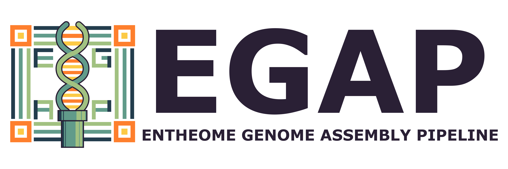
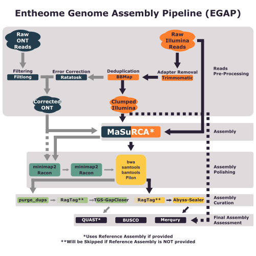

# EGAP Pipeline



## Overview
EGAP (Entheome Genome Assembly Pipeline) is a versatile bioinformatics pipeline developed for assembling high-quality hybrid genomes using Oxford Nanopore Technologies (ONT) and Illumina sequencing data. It also supports de novo and reference-based assemblies using Illumina data alone. The pipeline encompasses comprehensive steps for read quality control, trimming, genome assembly, polishing, and scaffolding. While optimized for fungal genomes, EGAP can be customized to work with other types of organisms.

## Table of Contents
1. [Overview](#overview)
2. [Installation](#installation)
3. [Pipeline Flow](#pipeline-flow)
4. [Command-Line Usage](#command-line-usage)
5. [CSV Generation](#csv-generation)
6. [Examples](#examples)
7. [Future Improvements](#future-improvements)
8. [References](#references)

## Installation
Ensure you have Python 3.8 installed. The pipeline has dependencies on a variety of bioinformatics tools, including but not limited to:
- [Trimmomatic](https://github.com/usadellab/Trimmomatic)
- [BBMap](https://sourceforge.net/projects/bbmap/)
- [FastQC](https://www.bioinformatics.babraham.ac.uk/projects/fastqc/)
- [NanoPlot](https://github.com/wdecoster/NanoPlot)
- [Filtlong](https://github.com/rrwick/Filtlong)
- [Ratatosk](https://github.com/DecodeGenetics/Ratatosk)
- [MaSuRCA](https://github.com/alekseyzimin/masurca)
- [Racon](https://github.com/lbcb-sci/racon)
- [Burrows-Wheeler Aligner](https://github.com/lh3/bwa)
- [SamTools](https://github.com/samtools/samtools)
- [BamTools](https://github.com/hartwigmedical/hmftools/tree/master/bam-tools)
- [Pilon](https://github.com/broadinstitute/pilon)
- [purge_dupes](https://github.com/dfguan/purge_dups)
- [RagTag](https://github.com/malonge/RagTag)
- [TGS-GapCloser](https://github.com/BGI-Qingdao/TGS-GapCloser)
- [ABYSS-Sealer](https://github.com/bcgsc/abyss/blob/master/Sealer/sealer.cc)
- [QUAST](https://github.com/ablab/quast)
- [CompleAsm](https://github.com/bioinformatics-centre/compleasm)
- [Merqury](https://github.com/marbl/merqury)

You can install pre-requisites using the shell script:

```bash
bash EGAP_setup.sh
```

## Pipeline Flow



## Command-Line Usage

### Parameters:

- \`--input_csv\`, \`-csv\` (str): Path to a CSV containing multiple sample data. (default = None)
- \`--raw_ont_reads\`, \`-i0\` (str): Path to the combined Raw ONT FASTQ reads. (if \`-csv\` = None; else REQUIRED)
- \`--raw_illu_dir\`, \`-idir\` (str): Path to a directory containing all Raw Illumina Reads. (if \`-csv\` = None; else REQUIRED)
- \`--raw_illu_reads_1\`, \`-i1\` (str): Path to the Raw Forward Illumina Reads. (if \`-csv\` = None; else REQUIRED)
- \`--raw_illu_reads_2\`, \`-i2\` (str): Path to the Raw Reverse Illumina Reads. (if \`-csv\` = None; else REQUIRED)
- \`--species_id\`, \`-ID\` (str): Species ID formatted as \`<2-letters of Genus>_<full species name>\`. (if \`-csv\` = None; else REQUIRED)
- \`--organism_kingdom\`, \`-K\` (str): Kingdom the current organism data belongs to. (default: Funga)
- \`--est_size\`, \`-es\` (str): Estimated size of the genome in Mbp (million base pairs). (default: 60m)
- \`--ref_seq\`, \`-rf\` (str): Path to the reference genome for assembly. (default: None)
- \`--percent_resources\`, \`-R\` (float): Percentage of resources for processing. (default: 1.00)

### Example Command:

```bash
python EGAP.py --raw_ont_reads /path/to/ont_reads.fq.gz \
               --raw_illu_dir /path/to/illumina_reads/ \
               --species_id AB_speciesname \
               --organism_kingdom Funga \
               --est_size 60m \
               --percent_resources 0.8
```

Alternatively, using a CSV file for multiple samples:

```bash
python EGAP.py --input_csv samples.csv
```

## CSV Generation

To run EGAP with multiple samples, you can provide a CSV file containing the necessary information for each sample. Below is the correct format for the CSV file:

### CSV Format

The CSV file should have the following header and columns:

| ONT_RAW_READS                  | ILLUMINA_RAW_F_READS                | ILLUMINA_RAW_R_READS                | ILLUMINA_RAW_DIR | SPECIES_ID     | ORGANISM_KINGDOM | EST_SIZE | REF_SEQ                  |
|--------------------------------|-------------------------------------|-------------------------------------|-------------------|----------------|------------------|----------|--------------------------|
| /path/to/ONT/sample1.fq.gz     | /path/to/Illumina/sample1_R1.fq.gz  | /path/to/Illumina/sample1_R2.fq.gz  | None              | AB_sample1     | Funga            | 60m      | /path/to/ref_genome1.fasta |
| /path/to/ONT/sample2.fq.gz     | /path/to/Illumina/sample2_R1.fq.gz  | /path/to/Illumina/sample2_R2.fq.gz  | None              | AB_sample2     | Funga            | 55m      | /path/to/ref_genome2.fasta |

### Column Descriptions

- **ONT_RAW_READS**: Path to the combined Raw ONT FASTQ reads (e.g., `/path/to/ONT/sample1.fq.gz`).
- **ILLUMINA_RAW_F_READS**: Path to the Raw Forward Illumina Reads (e.g., `/path/to/Illumina/sample1_R1.fq.gz`).
- **ILLUMINA_RAW_R_READS**: Path to the Raw Reverse Illumina Reads (e.g., `/path/to/Illumina/sample1_R2.fq.gz`).
- **ILLUMINA_RAW_DIR**: Path to the directory containing all Raw Illumina Reads. Use `None` if specifying individual read files.
- **SPECIES_ID**: Species ID formatted as `<2-letters of Genus>_<full species name>` (e.g., `AB_sample1`).
- **ORGANISM_KINGDOM**: Kingdom the current organism data belongs to (default: `Funga`).
- **EST_SIZE**: Estimated size of the genome in Mbp (million base pairs) (e.g., `60m`).
- **REF_SEQ**: Path to the reference genome for assembly. Use `None` if not applicable.

### Example CSV File (`samples.csv`)

```csv
ONT_RAW_READS,ILLUMINA_RAW_F_READS,ILLUMINA_RAW_R_READS,ILLUMINA_RAW_DIR,SPECIES_ID,ORGANISM_KINGDOM,EST_SIZE,REF_SEQ
/path/to/ONT/sample1.fq.gz,/path/to/Illumina/sample1_R1.fq.gz,/path/to/Illumina/sample1_R2.fq.gz,None,AB_sample1,Funga,60m,/path/to/ref_genome1.fasta
/path/to/ONT/sample2.fq.gz,/path/to/Illumina/sample2_R1.fq.gz,/path/to/Illumina/sample2_R2.fq.gz,None,AB_sample2,Funga,55m,/path/to/ref_genome2.fasta
```

### Notes

- If you provide a value for `ILLUMINA_RAW_DIR`, set `ILLUMINA_RAW_F_READS` and `ILLUMINA_RAW_R_READS` to `None`. EGAP will automatically detect and process all paired-end reads within the specified directory.
- Ensure that all file paths are correct and accessible.
- The CSV file should not contain any extra spaces or special characters in the headers.

## Examples

### Single Sample Assembly

```bash
python EGAP.py --raw_ont_reads /data/ONT/sample1.fq.gz \
               --raw_illu_reads_1 /data/Illumina/sample1_R1.fq.gz \
               --raw_illu_reads_2 /data/Illumina/sample1_R2.fq.gz \
               --species_id AB_sample1 \
               --organism_kingdom Funga \
               --est_size 55m
```

### Multiple Samples Using CSV

Create a `samples.csv` file as described above, then run:

```bash
python EGAP.py --input_csv samples.csv
```

## Future Improvements
- **Docker Integration**: Generate a Dockerfile for alternative installation option.
- **Improved Data Management**: Removal of excess files once pipeline complete.
- **Integration with Additional Sequencing Platforms**: Expand support beyond ONT and Illumina to include platforms like PacBio.
- **Enhanced Support for Diverse Genomes**: Optimize pipeline parameters for non-fungal genomes to improve versatility.
- **Improved Error Handling**: Develop more robust error detection and user-friendly feedback mechanisms.
- **Automated Quality Assessment Reports**: Generate comprehensive quality reports post-assembly for easier analysis.

## References
This pipeline was modified From two of the following pipelines:
    
    Bollinger IM, Singer H, Jacobs J, Tyler M, Scott K, Pauli CS, Miller DR,
    Barlow C, Rockefeller A, Slot JC, Angel-Mosti V. High-quality draft genomes
    of ecologically and geographically diverse Psilocybe species. Microbiol Resour
    Announc 0:e00250-24. https://doi.org/10.1128/mra.00250-24
    
    Muñoz-Barrera A, Rubio-Rodríguez LA, Jáspez D, Corrales A , Marcelino-Rodriguez I,
    Lorenzo-Salazar JM, González-Montelongo R, Flores C. Benchmarking of bioinformatics
    tools for the hybrid de novo assembly of human whole-genome sequencing data.
    bioRxiv 2024.05.28.595812; doi: https://doi.org/10.1101/2024.05.28.595812 

## Contribution
If you would like to contribute to the EGAP Pipeline, please submit a pull request or open an issue on GitHub. For major changes, please discuss them with us first via an issue.

## License
This project is licensed under the MIT License.
