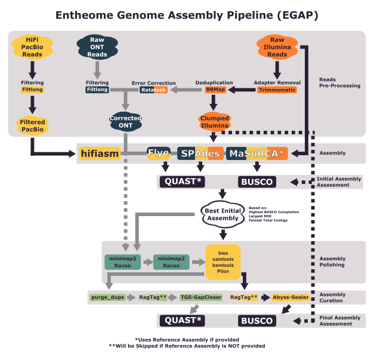
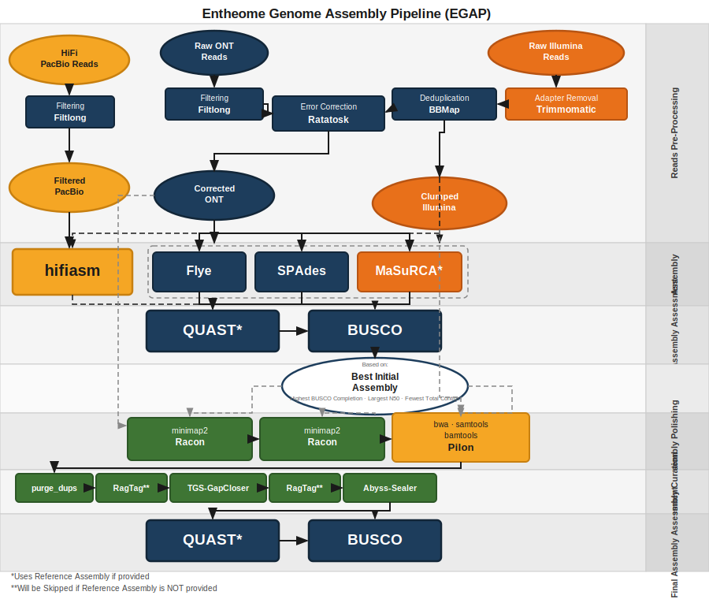
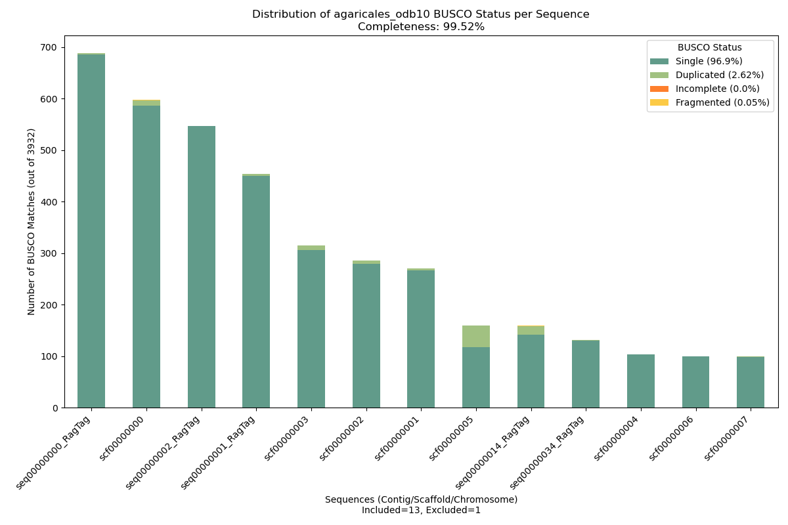
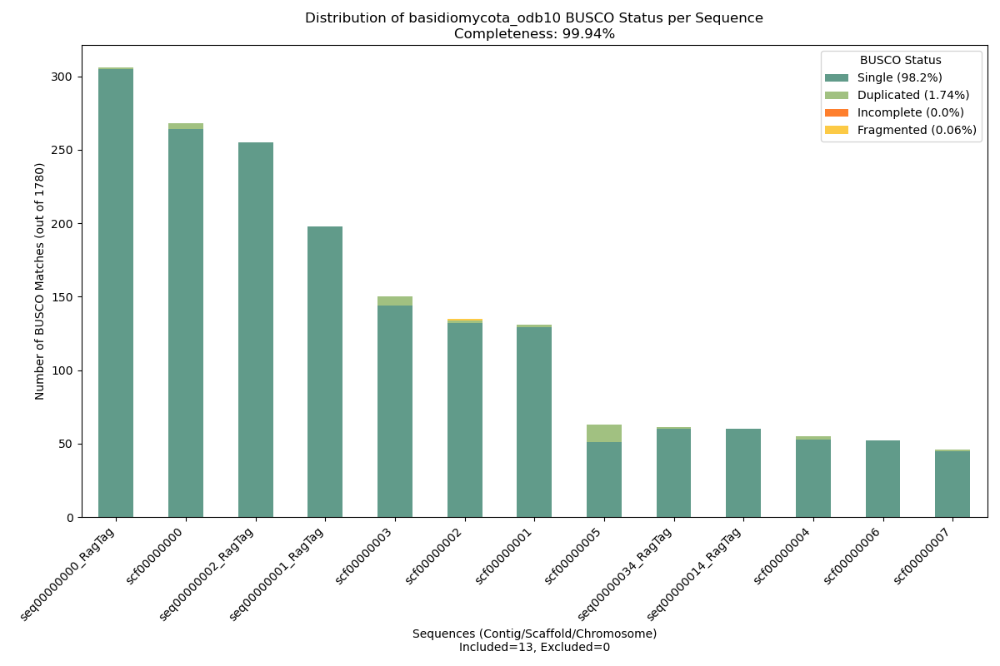
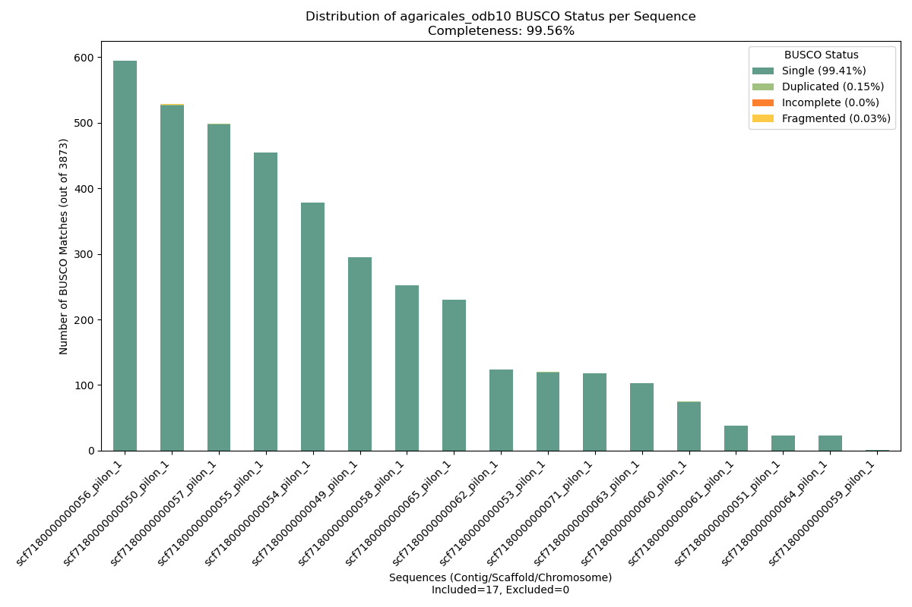
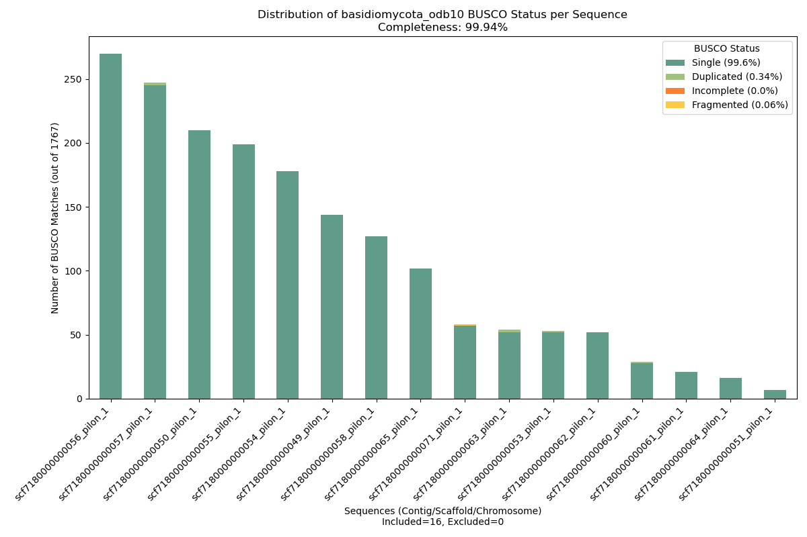
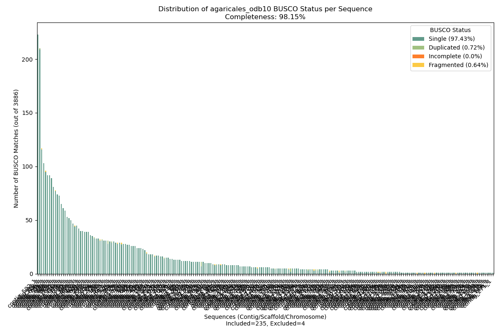
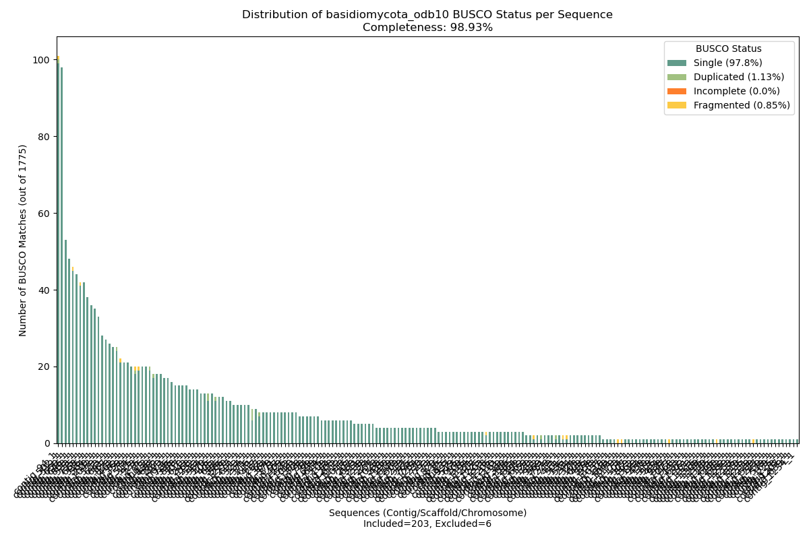

# EGAP Pipeline

<div align="center">
  
</div>

<div align="center">
  <!-- Conda Version -->
  <a href="https://anaconda.org/bioconda/egap">
    
  </a>
  <!-- Latest Release Date (from GitHub) -->
  <a href="https://github.com/iPsychonaut/EGAP/releases/latest">
    
  </a>
  <!-- Platforms (static "noarch") -->
  <a href="https://anaconda.org/bioconda/egap">
    
  </a>
  <!-- Total Downloads -->
  <a href="https://anaconda.org/bioconda/egap">
    
  </a>
  <!-- DOI -->
  <a href="https://doi.org/10.5281/zenodo.16938527">
    
  </a>
</div>

## Overview

EGAP (Entheome Genome Assembly Pipeline) v3.4.0 is a versatile bioinformatics pipeline for hybrid genome assembly using Oxford Nanopore (ONT), Illumina, and PacBio data. It evaluates assemblies based on BUSCO Completeness (Single + Duplicated), Assembly Contig Count, and N50, with additional metrics like L50 and GC-content available via QUAST.

1. **Preprocess & QC Reads**
   - Merges multiple FASTQ files (`ont_combine_fastq_gz`, `illumina_extract_and_check`).
   - Trims and removes adapters (Trimmomatic, BBDuk).
   - Deduplicates reads (Clumpify).
   - Filters and corrects ONT reads (Filtlong, Ratatosk).
   - Generates Read Metrics (FastQC, NanoPlot, BBMap insert-size stats).

2. **Read Decontamination** *(new in v3.4.0)*
   - Classifies ONT/PacBio long reads with **Kraken2** against a user-supplied database.
   - Retains reads matching the target organism's domain (eukarya / bacteria / archaea); always keeps unclassified reads.
   - Preserves all reads — kept reads continue to the assembler, removed reads are archived as a compressed `.fastq.gz` alongside the original pre-decontamination backup.
   - Non-fatal: skipped gracefully when no Kraken2 database is configured.

3. **Assembly**
   - MaSuRCA: Illumina-only or hybrid (ONT/PacBio).
   - Flye: ONT-only or PacBio-only.
   - SPAdes: Illumina-only or hybrid (ONT).
   - hifiasm: PacBio-only.
   - Best Assembly Selection based on Read Metrics from all available assemblies.
     - Runs BUSCO/Compleasm on two lineages for completeness.
     - Runs QUAST for contiguity (N50, contig count, etc.).

4. **Assembly Polishing**
   - Polishes with Racon (2x, if ONT/PacBio) and Pilon (if Illumina).
   - Removes haplotigs with purge_dups (if long reads).

5. **Assembly Curation**
   - Scaffolds and patches with RagTag (if reference provided).
   - Closes gaps with TGS-GapCloser (ONT) or Abyss-Sealer (Illumina-only).

6. **Assembly Decontamination** *(new in v3.4.0)*
   - Classifies every contig in the final curated assembly with **Tiara** (deep-learning classifier).
   - Removes non-target sequences (e.g. bacterial contamination from fungal assemblies).
   - Preserves removed sequences as a compressed `.fasta.gz` for auditability.
   - Decontaminated assembly is used for all downstream QC and reporting.

7. **Quality Assessments & Classification**
   - Runs BUSCO/Compleasm on two lineages for completeness.
   - Runs QUAST for contiguity (N50, contig count, etc.).
   - Classifies assemblies as **AMAZING**, **GREAT**, **OK**, or **POOR**.

Optimized for fungal genomes, EGAP is adaptable to other organisms by adjusting lineages and references.

**Supported Input Modes:**
- Illumina-only (SRA, DIR, or RAW FASTQ)
- Illumina + Reference (GCA or FASTA)
- Illumina + ONT (SRA, DIR, or RAW FASTQ)
- Illumina + ONT + Reference
- PacBio-only (SRA, DIR, or RAW FASTQ)
- Assembly-only (for QC analysis)

*Future developments:* Support for ONT-only and ONT + Reference.

## Table of Contents

1.  [Overview](#overview)
2.  [Installation](#installation)
3.  [Pipeline Flow](#pipeline-flow)
4.  [Command-Line Usage](#command-line-usage)
5.  [TUI Interface](#tui-interface)
6.  [File Management & Storage Optimization](#file-management--storage-optimization)
7.  [Per-Sample Logging](#per-sample-logging)
8.  [Decontamination](#decontamination)
9.  [CSV Generation](#csv-generation)
10. [Example Data & Instructions](#example-data--instructions)
11. [Quality Control Output Review](#quality-control-output-review)
12. [Future Improvements](#future-improvements)
13. [References](#references)
14. [Contribution](#contribution)
15. [License](#license)

## Installation

The following tools are installed:
- [Trimmomatic](https://github.com/usadellab/Trimmomatic)
- [BBMap](https://sourceforge.net/projects/bbmap/)
- [FastQC](https://www.bioinformatics.babraham.ac.uk/projects/fastqc/)
- [NanoPlot](https://github.com/wdecoster/NanoPlot)
- [Filtlong](https://github.com/rrwick/Filtlong)
- [Ratatosk](https://github.com/DecodeGenetics/Ratatosk)
- [gfatools](https://github.com/lh3/gfatools)
- [hifiasm](https://github.com/chhylp123/hifiasm)
- [MaSuRCA](https://github.com/alekseyzimin/masurca)
- [Flye](https://github.com/mikolmogorov/Flye)
- [SPAdes](https://github.com/ablab/spades)
- [Racon](https://github.com/lbcb-sci/racon)
- [Burrows-Wheeler Aligner](https://github.com/bwa-mem2/bwa-mem2)
- [SamTools](https://github.com/samtools/samtools)
- [BamTools](https://github.com/hartwigmedical/hmftools/tree/master/bam-tools)
- [Pilon](https://github.com/broadinstitute/pilon)
- [purge_dups](https://github.com/dfguan/purge_dups)
- [RagTag](https://github.com/malonge/RagTag)
- [TGS-GapCloser](https://github.com/BGI-Qingdao/TGS-GapCloser)
- [ABYSS-Sealer](https://github.com/bcgsc/abyss/blob/master/Sealer/sealer.cc)
- [QUAST](https://github.com/ablab/quast)
- [BUSCO](https://gitlab.com/ezlab/busco)
- [Compleasm](https://github.com/bioinformatics-centre/compleasm)
- [Kraken2](https://github.com/DerrickWood/kraken2) *(new in v3.4.0 — read decontamination)*
- [Tiara](https://github.com/ibe-uw/tiara) *(new in v3.4.0 — assembly decontamination)*
- [pigz](https://zlib.net/pigz/) *(new in v3.4.0 — parallel FASTA/FASTQ compression)*

##### Install Via Bash:
The available shell script: `EGAP_setup.sh`, can install all dependencies (Python 3.8+, Conda, and the main bioinformatics tools):

```bash
bash /path/to/EGAP/bin/EGAP_setup.sh
```

##### Install Via Docker:
Open a terminal in the directory where the `Dockerfile` is located and run:

```bash
docker build -t entheome_ecosystem .
```

Run the container (adjust the path accordingly):

```bash
docker run -it -v /path/to/data/mnt:/path/to/data/mnt entheome_ecosystem bash
```

Inside the Docker container, load the pre-generated EGAP environment:

```bash
source /EGAP_env/bin/activate
```

##### Install Via Nextflow/Singularity:
Open a terminal in the directory where the `entheome.sif.def` is located and run:

```bash
sudo singularity build entheome.sif entheome.sif.def
```

Edit the parameters in the nextflow.config and run (ensure the entheome.sif is in the same directory that draft_assembly.nf and nextflow.config are in):

```bash
nextflow draft_assembly.nf -with-singularity entheome.sif
```

OR

Load into the Singularity image, load the pre-generated EGAP environment:

```bash
singularity shell entheome.sif -B /path/to/data/mnt:/path/to/data/mnt && \
source /opt/conda/etc/profile.d/conda.sh && \
conda activate EGAP_env
```

##### Install Via Anaconda:
In a dedicated environment through the Bioconda channel with the following command:

```bash
conda create -y -n EGAP_env python=3.8 && conda activate EGAP_env && conda install -y -c bioconda egap
```

##### Kraken2 Database Setup (required for read decontamination):
EGAP uses Kraken2 to screen long reads for contamination. A Kraken2 database must be downloaded separately and the path provided via the `KRAKEN2_DB` environment variable. The pre-built Standard 16 GB database is recommended:

```bash
# Download the pre-built Standard 16 GB database
wget https://genome-idx.s3.amazonaws.com/kraken/k2_standard_16gb_20240904.tar.gz
mkdir -p ~/kraken2_db
tar -xzf k2_standard_16gb_20240904.tar.gz -C ~/kraken2_db

# Set the environment variable for the current session and make it permanent
export KRAKEN2_DB=~/kraken2_db
echo 'export KRAKEN2_DB=~/kraken2_db' >> ~/.bashrc
```

> **Docker users:** Pass the variable and mount the database directory at runtime:
> ```bash
> docker run -it \
>   -v /path/to/kraken2_db:/kraken2_db \
>   -e KRAKEN2_DB=/kraken2_db \
>   -v /path/to/data:/data \
>   entheome_ecosystem bash
> ```

> **Singularity users:** Bind-mount the database directory and export the variable before running:
> ```bash
> export KRAKEN2_DB=/path/to/kraken2_db
> singularity shell entheome.sif \
>   -B /path/to/kraken2_db:/path/to/kraken2_db \
>   -B /path/to/data:/data
> ```

If `KRAKEN2_DB` is not set or points to an invalid path, the read-decontamination step is skipped automatically and a warning is printed to the log.

## Pipeline Flow

<div align="center">
  
</div>

<div align="center">
  
</div>

## Command-Line Usage

### Parameters

| Flag | Short | Type | Default | Description |
|------|-------|------|---------|-------------|
| `--input_csv` | `-csv` | str | *(required)* | Path to CSV with sample data |
| `--output_dir` | `-o` | str | *(required)* | Path to the desired output directory |
| `--cpu_threads` | `-t` | int | `1` | Number of CPU threads to use |
| `--ram_gb` | `-r` | int | `8` | RAM in GB to allocate |
| `--dry_run` | | flag | `False` | Log all file-management actions (removals, compressions) without executing them. Equivalent to setting `EGAP_DRY_RUN=1` in the environment. |
| `--tui` | | flag | `False` | Launch the interactive TUI instead of plain terminal output. All other flags pass through to the TUI. |

### Example Commands

Standard run:
```bash
EGAP -csv /path/to/input.csv -o /path/to/output_dir -t 16 -r 64
```

Run with the interactive TUI:
```bash
EGAP -csv /path/to/input.csv -o /path/to/output_dir -t 16 -r 64 --tui
```

Audit what would be cleaned up without deleting anything:
```bash
EGAP -csv /path/to/input.csv -o /path/to/output_dir -t 16 -r 64 --dry_run
```

Audit in TUI mode:
```bash
EGAP -csv /path/to/input.csv -o /path/to/output_dir -t 16 -r 64 --tui --dry_run
```

### Environment Variables

| Variable | Description |
|----------|-------------|
| `EGAP_DRY_RUN=1` | Enable dry-run mode (equivalent to `--dry_run`). Checked at each file-management call so it can be set after import. |
| `KRAKEN2_DB=/path/to/db` | Path to a Kraken2 database for read decontamination. Alternatively, supply a `KRAKEN2_DB` column in the CSV. If neither is set, the decontamination step is skipped with a warning. |

## TUI Interface

EGAP v3.4.0 includes a full terminal user interface built with [Textual](https://github.com/Textualize/textual). It provides a live view of pipeline progress without leaving the terminal.

### Launching

The TUI can be started in two ways:

**Via the `--tui` flag on `EGAP.py` (recommended)** — all arguments pass through automatically:
```bash
EGAP -csv /path/to/input.csv -o /path/to/output_dir -t 16 -r 64 --tui
```

**Standalone** (from the `bin/` directory):
```bash
python EGAP_TUI.py -csv /path/to/input.csv -o /path/to/output_dir -t 16 -r 64
```

Both launch modes support `--dry_run`.

### Layout

```
┌─────────────────────────────────────┬───────────────────────────────────────┐
│  EGAP Banner (ANSI art)             │  Pipeline Settings (auto-scrolling)   │
├─────────────────┬───────────────────┴────────────┬──────────────────────────┤
│  Live Log       │  Step Progress Table            │  CPU / RAM Monitor       │
│  (streaming)    │  (per-sample, per-step)         │  (per-core history)      │
└─────────────────┴─────────────────────────────────┴──────────────────────────┘
```

- **Live Log** — real-time streaming of all subprocess output, with numpy API noise filtered out.
- **Step Progress Table** — one row per sample × step; cells update from `PENDING → RUNNING → PASS/FAIL` as each step completes.
- **CPU / RAM Monitor** — per-core utilization history bars and live RAM/swap usage, refreshed every 0.5 s.
- **Settings Panel** — all pipeline settings pulled from `EGAP.py`'s single source of truth, auto-scrolling through the full list.

### Keyboard Shortcuts

| Key | Action |
|-----|--------|
| `q` or `Ctrl+Q` | Gracefully shut down the pipeline (SIGTERM → SIGKILL) and quit |
| `F2` | Copy the full log buffer to the clipboard |

## File Management & Storage Optimization

A single EGAP run can grow from ~60 GB to 300+ GB of intermediate files that are not needed after each step completes. v3.4.0 introduces automatic cleanup via the centralized `bin/file_manager.py` module.

### What Gets Cleaned Up

| Step | Files / Directories Removed After Confirmation |
|------|------------------------------------------------|
| **Pilon prep** | The SAM file (can be 10+ GB) is deleted as soon as the sorted BAM is confirmed. The intermediate sorted BAM is deleted once the final indexed BAM is ready. |
| **Polish assembly** | Racon PAF alignment files (`*.paf`), per-round Racon FASTAs (`_racon_polish_1.fasta`, `_racon_polish_2.fasta`), and all five BWA-mem2 index sidecars (`.0123`, `.bwt.2bit.64`, `.pac`, `.amb`, `.ann`). |
| **MaSuRCA assembly** | The `CA/` CABOG intermediate tree (~11 GB), `work1/`, and large working files (`pe.cor.fa`, `pe.linking.fa`, the Guillaume K-unitig FASTAs, `bbmerge_interleaved.fq`, `bbmap_data.fq`). |
| **SPAdes assembly** | Per-kmer directories (`K21/` through `K99/`), `contigs.fasta`, `before_rr.fasta`, `misc/`, `tmp/`. |
| **Compleasm (QC)** | Lineage `.tar.gz` archives in `mb_downloads/` once the extracted directory and `.done` marker are both confirmed present. |
| **Read decontamination** | The pre-decontamination backup and the removed-reads file are compressed to `.fastq.gz` with pigz. The active decontaminated file used by assemblers is left uncompressed. |
| **Assembly decontamination** | The Tiara working FASTAs (`_tiara_kept.fasta`, `_tiara_removed.fasta`) are compressed to `.fasta.gz`. The final output (`_decontaminated.fasta`) is left uncompressed for downstream tools. |

### Dry-Run Mode

To audit exactly what would be deleted/compressed without touching any files:

```bash
# Via CLI flag
EGAP -csv input.csv -o output/ -t 16 -r 64 --dry_run

# Via environment variable (also works for subprocesses)
export EGAP_DRY_RUN=1
EGAP -csv input.csv -o output/ -t 16 -r 64
```

Every planned action is logged with the size that would be freed:
```
DRY_RUN:    Would remove file (11.2 GB): /path/to/sample/pilon_polish/racon.sam
DRY_RUN:    Would remove directory (10.8 GB): /path/to/sample/masurca_assembly/CA
```

### Safe-Removal Guarantees

- **Never removes on error**: files are only cleaned up after the downstream output is confirmed present and non-empty.
- **Preserves step-skip guards**: files required by existing `if os.path.exists(...)` re-run checks are always kept.
- **Logs freed space**: every real deletion logs the size freed, e.g. `NOTE: Removed intermediate file (11.2 GB freed): ...`.

## Per-Sample Logging

Each row in the input CSV gets its own log file written in real time throughout the run:

```
{output_dir}/{sample_id}_log.txt
```

- Opened in **append** mode so re-runs accumulate into the same file.
- Contains all standard output for that sample's steps (ANSI escape codes stripped for clean reading).
- In plain terminal mode, stdout is simultaneously mirrored to the terminal and the log file via an internal `_Tee` class.
- In TUI mode, the TUI's `log_line()` method writes to both the on-screen log widget and the per-sample file.

## Decontamination

### Read Decontamination (Kraken2 — pre-assembly)

Runs after ONT/PacBio preprocessing and before assembly. Classifies every read against a Kraken2 database and partitions them by domain.

**Domain keep profiles:**

| Organism Kingdom | Domains Kept | Domains Removed |
|-----------------|--------------|-----------------|
| Bacteria | bacteria, unclassified, other | archaea, eukarya, viruses |
| Archaea | archaea, unclassified, other | bacteria, eukarya, viruses |
| Flora / Funga / Fauna | eukarya, unclassified, other | bacteria, archaea, viruses |

`unclassified` and `other` reads are **always kept** because they may represent genuine target sequence absent from the database or with ambiguous taxonomy.

**Configuring the Kraken2 database** (in priority order):
1. `KRAKEN2_DB` environment variable
2. `KRAKEN2_DB` column in the input CSV

If neither is set the step is skipped with a `WARN` — it is non-fatal.

**Output files** (all in `{species_dir}/kraken2_reads/`):

| File | Description |
|------|-------------|
| `{label}_kraken2.out` | Raw Kraken2 per-read output |
| `{label}_kraken2_report.txt` | Kraken2 summary report |
| `{label}_removed_reads.fastq.gz` | Contaminant reads (compressed, kept for audit) |
| `decontaminate_reads_done.txt` | Completion marker (prevents re-running on resume) |

The original pre-decontamination reads are renamed to `_pre_decontam.fastq.gz` (compressed). The decontaminated reads overwrite the `_highest_mean_qual_long_reads.fastq` path that all assemblers already expect, so no assembler changes are needed.

### Assembly Decontamination (Tiara — post-assembly)

Runs after curation and before final QC. Classifies every contig using Tiara's deep-learning model.

**Class keep profiles:**

| Organism Kingdom | Classes Kept | Classes Removed |
|-----------------|--------------|-----------------|
| Bacteria | bacteria, prokarya, unknown | eukarya, archaea, organelle |
| Archaea | archaea, prokarya, unknown | eukarya, bacteria, organelle |
| Flora / Funga / Fauna | eukarya, organelle, unknown | bacteria, archaea, prokarya |

`organelle` is kept for eukaryotes (mitochondria, plastids) but removed for prokaryotes (likely host contamination). `unknown` is always kept to avoid discarding genuine low-complexity sequence.

**Output files** (all in `{sample_dir}/decontamination/`):

| File | Description |
|------|-------------|
| `tiara_output.txt` | Raw Tiara classification TSV |
| `{sample_id}_tiara_kept.fasta.gz` | Retained sequences (compressed working copy) |
| `{sample_id}_tiara_removed.fasta.gz` | Removed sequences (compressed, kept for audit) |
| `decontamination_done.txt` | Completion marker |

The final decontaminated assembly is written to `{sample_dir}/{sample_id}_decontaminated.fasta` (uncompressed, for downstream tools).

A warning is issued if more than 50% of sequences are removed — this may indicate an incorrect kingdom assignment or an unexpected Tiara result.

## CSV Generation

It is necessary to provide a CSV file containing the necessary information for each sample.

### CSV Format

The CSV file should have the following header and columns:

| ONT_SRA | ONT_RAW_DIR | ONT_RAW_READS | ILLUMINA_SRA | ILLUMINA_RAW_DIR | ILLUMINA_RAW_F_READS | ILLUMINA_RAW_R_READS | PACBIO_SRA | PACBIO_RAW_DIR | PACBIO_RAW_READS | SPECIES_ID | SAMPLE_ID | ORGANISM_KINGDOM | ORGANISM_KARYOTE | BUSCO_1 | BUSCO_2 | EST_SIZE | REF_SEQ_GCA | REF_SEQ | KRAKEN2_DB |
|---------|-------------|---------------|--------------|------------------|----------------------|----------------------|------------|----------------|-----------------|------------|-----------|-----------------|-----------------|---------|---------|----------|-------------|---------|------------|
| None | None | None | SRA00000001 | None | None | None | None | None | None | Ab_sample1 | Ab_sample1 | Funga | Eukaryote | basidiomycota | agaricales | 55m | GCA00000001.1 | None | None |
| None | None | /path/to/ONT/sample.fastq | None | None | /path/to/Illumina/s_1.fastq | /path/to/Illumina/s_2.fastq | None | None | None | Ab_sample2 | Ab_sample2_ONT | Funga | Eukaryote | basidiomycota | agaricales | 60m | None | None | /path/to/kraken2_db |

### Column Descriptions

- **ONT_SRA**: Oxford Nanopore Sequence Read Archive (SRA) Accession number. Use `None` if specifying individual files.
- **ONT_RAW_DIR**: Path to the directory containing all Raw ONT Reads. Use `None` if specifying individual files.
- **ONT_RAW_READS**: Path to the combined Raw ONT FASTQ reads (e.g., `/path/to/ONT/sample1.fastq`).
- **ILLUMINA_SRA**: Illumina Sequence Read Archive (SRA) Accession number. Use `None` if specifying individual files.
- **ILLUMINA_RAW_DIR**: Path to the directory containing all Raw Illumina Reads. Use `None` if specifying individual files.
- **ILLUMINA_RAW_F_READS**: Path to the Raw Forward Illumina Reads (e.g., `/path/to/Illumina/sample1_1.fastq`).
- **ILLUMINA_RAW_R_READS**: Path to the Raw Reverse Illumina Reads (e.g., `/path/to/Illumina/sample1_2.fastq`).
- **PACBIO_SRA**: PacBio Sequence Read Archive (SRA) Accession number. Use `None` if specifying individual files.
- **PACBIO_RAW_DIR**: Path to the directory containing all Raw PacBio Reads. Use `None` if specifying individual files.
- **PACBIO_RAW_READS**: Path to the combined Raw PacBio FASTQ reads (e.g., `/path/to/PACBIO/sample1.fastq`).
- **SPECIES_ID**: Species ID formatted as `<full species name>` (e.g., `Escherichia_coli`).
- **SAMPLE_ID**: Sample ID formatted as `<full species name>-<other identifiers>` (e.g., `Escherichia_coli-Illu-SRR32496875`).
- **ORGANISM_KINGDOM**: Kingdom of the organism (`Bacteria`, `Archaea`, `Flora`, `Funga`, or `Fauna`). Used by both Kraken2 and Tiara decontamination.
- **ORGANISM_KARYOTE**: Karyote type of the organism (e.g., `Eukaryote`, `Prokaryote`).
- **BUSCO_1**: Name of the first Compleasm/BUSCO database (e.g., `basidiomycota`).
- **BUSCO_2**: Name of the second Compleasm/BUSCO database (e.g., `agaricales`).
- **EST_SIZE**: Estimated genome size (e.g., `55m` for 55 Mbp, `5g` for 5 Gbp).
- **REF_SEQ_GCA**: Curated Genome Assembly (GCA) Accession number (or `None`).
- **REF_SEQ**: Path to the reference genome for assembly scaffolding (or `None`).
- **KRAKEN2_DB** *(optional, new in v3.4.0)*: Path to a Kraken2 database for read decontamination. Overrides the `KRAKEN2_DB` environment variable. Omit the column entirely or use `None` to rely on the env var or skip decontamination.

### Notes

- If you are providing **ANY** raw reads, ensure they exist in their appropriate folder (`/path/to/sample_dir/Illumina`, `/path/to/sample_dir/ONT`, etc.); you may need to generate the sample_dir based on the output_dir, species_id, and then sample_id (`/output_dir/species_id/sample_id`).
- If you are providing `ILLUMINA_RAW_F_READS` and `ILLUMINA_RAW_R_READS`, please make sure the directory path the files are in **DO NOT CONTAIN** `_1` or `_2`, but the actual **READS FILES DO CONTAIN** `_1` or `_2`.
- If you provide a value for `ILLUMINA_RAW_DIR`, set `ILLUMINA_RAW_F_READS` and `ILLUMINA_RAW_R_READS` to `None`. EGAP will automatically detect and process all paired-end reads within that directory. The same applies for `ONT_RAW_DIR`.
- EGAP automatically renames `.fq` and `.fq.gz` files to `.fastq` / `.fastq.gz` at startup.
- Ensure that all file paths are correct and accessible.
- The CSV file should not contain extra spaces or special characters in the headers.
- If you just want to perform QC analysis for an already built assembly: provide the path for the assembly or GCA Accession number to download, in the `REF_SEQ` or `REF_SEQ_GCA` field respectively, provide `ORGANISM_KARYOTE`, and the two BUSCO databases (`BUSCO_1`, `BUSCO_2`) to use; **DO NOT PROVIDE ESTIMATED SIZE (`EST_SIZE`)**.

### Example CSV File

`EGAP_test.csv` is included in this repository to run test examples. Running all four files takes about 24 hours on a 16-thread, 64 GB system.

```csv
ONT_SRA,ONT_RAW_DIR,ONT_RAW_READS,ILLUMINA_SRA,ILLUMINA_RAW_DIR,ILLUMINA_RAW_F_READS,ILLUMINA_RAW_R_READS,PACBIO_SRA,PACBIO_RAW_DIR,PACBIO_RAW_READS,SAMPLE_ID,SPECIES_ID,ORGANISM_KINGDOM,ORGANISM_KARYOTE,BUSCO_1,BUSCO_2,EST_SIZE,REF_SEQ_GCA,REF_SEQ,KRAKEN2_DB
None,None,None,None,None,None,None,None,None,None,Escherichia_coli-RefSeq,Escherichia_coli,Bacteria,prokaryote,gammaproteobacteria,enterobacterales,None,GCA_000005845.2,None,None
None,None,None,SRR32496875,None,None,None,None,None,None,Escherichia_coli-Illu-RefSeq,Escherichia_coli,Bacteria,prokaryote,gammaproteobacteria,enterobacterales,5m,GCA_000005845.2,None,None
SRR32405433,None,None,SRR32496875,None,None,None,None,None,None,Escherichia_coli-ONT-Illu,Escherichia_coli,Bacteria,prokaryote,gammaproteobacteria,enterobacterales,5m,None,None,/path/to/kraken2_db
None,None,None,None,None,None,None,SRR31460895,None,None,Escherichia_coli-PacBio,Escherichia_coli,Bacteria,prokaryote,gammaproteobacteria,enterobacterales,5m,None,None,None
```

### Local Data
If you are providing your own data locally, be sure to have a species folder and if needed a sub-folder matching your Species ID:

Example: Illumina + ONT data for *Psilocybe cubensis* B+ with reference sequence:
- `/path/to/EGAP/EGAP_Processing/Ps_cubensis/Ps_cubensis_B+/Illumina/f_reads.fastq`
- `/path/to/EGAP/EGAP_Processing/Ps_cubensis/Ps_cubensis_B+/Illumina/r_reads.fastq`
- `/path/to/EGAP/EGAP_Processing/Ps_cubensis/Ps_cubensis_B+/ONT/reads.fastq`
- `/path/to/EGAP/EGAP_Processing/Ps_cubensis/ref_seq.fasta`

If no sub-folder for sub-species is needed, place everything in the main species folder:
- `/path/to/EGAP/EGAP_Processing/Ps_semilanceata/Illumina/f_reads.fastq`

## Quality Control Output Review

EGAP generates final assemblies along with:
- **QUAST** metrics (contig count, N50, L50, GC%, coverage)
- **BUSCO/Compleasm** plots showing Single, Duplicated, Fragmented & Missing scores.
- Final assembly classification: **AMAZING, GREAT, OK,** or **POOR**
- **Per-sample log file** (`{sample_id}_log.txt`) with the full run record.

### Statistics Thresholds

The current thresholds for each metric classification (subject to change) are:
- **first_busco_c** = {"AMAZING": ≥98.5, "GREAT": ≥90.0, "OK": ≥75.0, "POOR": <75.0}
- **second_busco_c** = {"AMAZING": ≥98.5, "GREAT": ≥90.0, "OK": ≥75.0, "POOR": <75.0}
- **contigs_thresholds** = {"AMAZING": <100, "GREAT": <1000, "OK": <10000, "POOR": >10000}
- **n50_thresholds** = {"AMAZING": >100000, "GREAT": >10000, "OK": >1000, "POOR": <1000}
- **l50_thresholds** = {"AMAZING": #, "GREAT": #, "OK": #, "POOR": #} *(still determining best metrics)*

### Compleasm BUSCO Plots

BUSCO outputs are evaluated based on:
- Greater than or equal to 98.5% Completion (sum of Single and Duplicated genes) for an AMAZING/Great Assembly
- Greater than 90.0% Completion for a Good Assembly
- Greater than 75% Completion for an OK Assembly
- Less than 75% Completion for a POOR Assembly

Additionally, fewer contigs aligning to BUSCO genes is preferable. Contigs with only duplicated genes are excluded from the plot (noted in the x-axis label).

#### Illumina-Only (with Reference Sequence) Assembly BUSCO Plots

<table align="center">
  <tr>
    <td align="center">
      
      <br>
      <b>Ps. cubensis B+ agaricales BUSCO</b>
    </td>
    <td align="center">
      
      <br>
      <b>Ps. cubensis B+ basidiomycota BUSCO</b>
    </td>
  </tr>
</table>

#### ONT/Illumina Hybrid Assembly BUSCO Plots

<table align="center">
  <tr>
    <td align="center">
      
      <br>
      <b>Ps. semilanceata agaricales BUSCO</b>
    </td>
    <td align="center">
      
      <br>
      <b>Ps. semilanceata basidiomycota BUSCO</b>
    </td>
  </tr>
</table>

#### PacBio-Only (no Reference Sequence) Assembly BUSCO Plots

<table align="center">
  <tr>
    <td align="center">
      
      <br>
      <b>Pa. papilionaceus agaricales BUSCO</b>
    </td>
    <td align="center">
      
      <br>
      <b>Pa. papilionaceus basidiomycota BUSCO</b>
    </td>
  </tr>
</table>

## Future Improvements

- **Enhanced Support for Diverse Genomes**: Optimize pipeline parameters for non-fungal genomes to improve versatility.
- **Improved Error Handling**: Develop robust error detection and user-friendly feedback.
- **Integration with Additional Sequencing Platforms**:
  - Support for ONT-only and ONT + Reference input modes.
- **FASTA/FASTQ Compression at Handoff Points**: Automatically compress intermediate read files with pigz at appropriate handoff points between steps, with transparent decompression for tools that require uncompressed input.
- **Automated HTML Report Improvements**: Expand the HTML report to include decontamination statistics, file management savings, and TUI-style step timing.

## References

This pipeline was modified from two of the following pipelines:

> Bollinger IM, Singer H, Jacobs J, Tyler M, Scott K, Pauli CS, Miller DR, Barlow C, Rockefeller A, Slot JC, Angel-Mosti V.
> High-quality draft genomes of ecologically and geographically diverse *Psilocybe* species.
> *Microbiol Resour Announc* 0:e00250-24; doi: [10.1128/mra.00250-24](https://doi.org/10.1128/mra.00250-24)

> Muñoz-Barrera A, Rubio-Rodríguez LA, Jáspez D, Corrales A, Marcelino-Rodriguez I, Lorenzo-Salazar JM, González-Montelongo R, Flores C.
> Benchmarking of bioinformatics tools for the hybrid de novo assembly of human whole-genome sequencing data.
> *bioRxiv* 2024.05.28.595812; doi: [10.1101/2024.05.28.595812](https://doi.org/10.1101/2024.05.28.595812)

The example data are published in:

> Bollinger IM, Singer H, Jacobs J, Tyler M, Scott K, Pauli CS, Miller DR, Barlow C, Rockefeller A, Slot JC, Angel-Mosti V.
> High-quality draft genomes of ecologically and geographically diverse *Psilocybe* species.
> *Microbiol Resour Announc* 0:e00250-24; doi: [10.1128/mra.00250-24](https://doi.org/10.1128/mra.00250-24)

> McKernan K, Kane L, Helbert Y, Zhang L, Houde N, McLaughlin S.
> A whole genome atlas of 81 Psilocybe genomes as a resource for psilocybin production.
> F1000Research 2021, 10:961; doi: [10.12688/f1000research.55301.2](https://doi.org/10.12688/f1000research.55301.2)

> Ruiz‐Dueñas FJ, Barrasa JM, Sánchez‐García M, Camarero S, Miyauchi S, Serrano A, Linde D, Babiker R, Drula E, Ayuso‐Fernández I, Pacheco R,
> Padilla G, Ferreira P, Barriuso J, Kellner H, Castanera R, Alfaro M, Ramírez L, Pisabarro AG, Riley R, Kuo A, Andreopoulos W, LaButti K,
> Pangilinan J, Tritt A, Lipzen A, He G, Yan M, Ng V, Grigoriev IV, Cullen D, Martin F, Rosso M, Henrissat B, Hibbett D, Martínez AT.
> Genomic Analysis Enlightens Agaricales Lifestyle Evolution and Increasing Peroxidase Diversity. Molecular Biology and Evolution. 38(4): 1428-1446 (2020). [10.1093/molbev/msaa301](https://doi.org/10.1093/molbev/msaa301).

> Floudas D, Bentzer J, Ahrén D, Johansson T, Persson P, Tunlid A.
> Uncovering the hidden diversity of litter-decomposition mechanisms in mushroom-forming fungi.
> ISME J 14, 2046–2059 (2020). [10.1038/s41396-020-0667-6](https://doi.org/10.1038/s41396-020-0667-6).

## Contribution

If you would like to contribute to the EGAP Pipeline, please submit a pull request or open an issue on GitHub. For major changes, please discuss via an issue first.

## License

This project is licensed under the BSD 3-Clause License.
